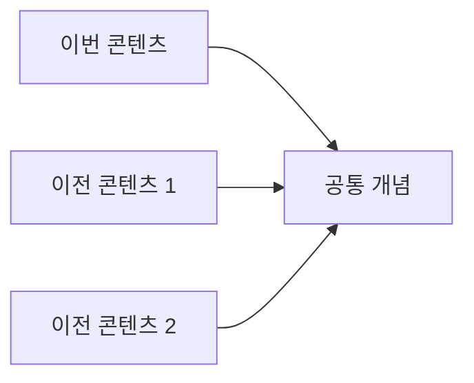

# Content Digest

콘텐츠 → Quiz-First 학습 → 선택적 깊이 탐색 → 근본 개념 확장.

> **Task Agent 기반 설계**: 긴 컨텍스트는 subagent가 처리하고, 메인 세션은 최종 결론만 소비

## 아키텍처 원칙

1. **Context Separation**: 긴 자막/본문은 Task agent가 처리, 메인 세션은 가벼운 md 파일만 Read
2. **Clean Transcript**: 자막에서 번호, 시간 제거 → 순수 영어 텍스트만 추출
3. **Web Research Integration**: 추출된 키워드로 자동 웹 리서치
4. **Single Output**: 모든 처리 결과는 단일 md 파일로 저장

## 지원 콘텐츠

| 타입 | 추출 방법 | 저장 경로 |
|-----|----------|----------|
| YouTube | Task agent (yt-dlp + 정제) | `research/digests/youtube/` |
| X/Twitter | fetch-tweet 스킬 (api.fxtwitter.com) | `research/digests/tweet/` |
| Webpage | Task agent (browser + 정제) | `research/digests/web/` |
| PDF | Task agent (Read + 정제) | `research/digests/pdf/` |

## 핵심 원칙

1. **Quiz-First**: 요약 보기 전에 퀴즈부터 (Pretesting Effect → 9-12% 향상)
2. **Knowledge Gap**: 틀린 문제가 호기심을 만들고, 호기심이 기억을 강화
3. **선택적 깊이**: 사용자가 더 알고 싶은 부분만 깊게
4. **근본 확장**: 콘텐츠 너머의 기초 개념까지 웹 검색으로 확장

---

## 워크플로우 개요 (Task Agent 기반)

```
Phase 1: 콘텐츠 타입 감지
Phase 2: Task Agent 실행 (콘텐츠 추출 + 정제 + 웹 리서치 + md 저장)
Phase 3: 메인 세션에서 결과 md Read
Phase 4: Pre-Quiz (3문제)
Phase 5: 선택적 콘텐츠 제공
Phase 6: 본 퀴즈 (9문제)
Phase 7: Elaborative Interrogation
Phase 8: Foundation Expansion
Phase 9: 스키마 연결
Phase 10: 문서 업데이트 (퀴즈 결과 반영)
Phase 11: 후속 선택
```

---

## Phase 1: 콘텐츠 타입 감지

입력 패턴에 따라 콘텐츠 타입 자동 결정:

| 패턴 | 타입 |
|------|------|
| `youtube.com`, `youtu.be` | YouTube |
| `x.com`, `twitter.com` | X/Twitter |
| `http://`, `https://` (기타) | Webpage |
| `.pdf` 파일 경로 | PDF |

명확하지 않으면 사용자에게 확인:

```
AskUserQuestion:
questions:
  - question: "어떤 콘텐츠를 분석할까요?"
    header: "Type"
    options:
      - label: "YouTube 영상"
        description: "URL을 알려주세요"
      - label: "웹페이지/아티클"
        description: "URL을 알려주세요"
      - label: "PDF 문서"
        description: "파일 경로를 알려주세요"
```

---

## Phase 2: Task Agent 실행 (핵심)

> **메인 세션의 context를 보호하면서 긴 콘텐츠를 처리**

### 2-1. Task Agent 호출 패턴

```
Task:
  subagent_type: "general-purpose"
  description: "콘텐츠 추출 및 분석"
  prompt: |
    ## 목표
    {URL/파일경로}에서 콘텐츠를 추출하고 분석하여 md 파일로 저장

    ## 단계 (순서 중요)
    1. 콘텐츠 추출 (타입별 방법 적용)
    2. 텍스트 정제 (번호, 시간 제거 → 영어만 추출)
    3. 핵심 키워드 추출 (5-10개)
    4. 웹 리서치 (키워드별 WebSearch)
    5. **핵심 요약 생성** (3-5문장)
    6. **주요 인사이트 도출** (3개)
    7. **퀴즈 재료 생성** (요약/인사이트 기반으로 핵심 주제만)
    8. md 파일 저장

    ## 출력 경로
    research/digests/{type}/{YYYY-MM-DD}-{sanitized-title}.md
```

### 2-2. X/Twitter 추출 (fetch-tweet 스킬 활용)

> **Task Agent 불필요** - fetch-tweet 스크립트로 직접 추출 (짧은 콘텐츠)

```bash
# 트윗 원문 + 인게이지먼트 데이터 추출
python3 .claude/skills/fetch-tweet/scripts/fetch_tweet.py "{URL}" --json
```

JSON 응답에서 활용할 필드:
- `tweet.text`: 트윗 본문
- `tweet.author`: 작성자 정보 (name, bio, followers)
- `tweet.likes/retweets/views`: 인게이지먼트
- `tweet.quote`: 인용 트윗 (있을 경우 동일 구조)
- `tweet.media`: 첨부 이미지/영상

트윗은 짧으므로 Task Agent 없이 메인 세션에서 직접 처리.
인용 트윗이 있으면 함께 포함하여 분석.
저장 경로: `research/digests/tweet/{YYYY-MM-DD}-{author}-{short-topic}.md`

### 2-3. YouTube 추출 (Task Agent 내부)


```bash
# 1. 자막 추출
yt-dlp --write-auto-sub --sub-lang "en" --skip-download \
  --convert-subs vtt -o "%(title)s" "{URL}"

# 2. VTT → 순수 텍스트 변환
sed -E 's/^[0-9]+$//' | \                    # 번호 제거
sed -E 's/[0-9]{2}:[0-9]{2}:[0-9]{2}.*//g' | \  # 타임스탬프 제거
sed -E 's/<[^>]+>//g' | \                    # HTML 태그 제거
tr -s '\n' | \                               # 빈 줄 정리
grep -v '^$'                                 # 빈 줄 삭제
```

정제 결과: 순수 영어 텍스트만 남음 (시간, 번호, 중복 없음)

### 2-4. Webpage 추출 (Task Agent 내부)

```
1. mcp__claude-in-chrome__tabs_context_mcp
2. mcp__claude-in-chrome__tabs_create_mcp
3. mcp__claude-in-chrome__navigate: url="{URL}"
4. mcp__claude-in-chrome__get_page_text: tabId={tabId}
5. 스크롤 후 추가 콘텐츠 확인
```

### 2-5. PDF 추출 (Task Agent 내부)

```
Read: file_path="{PDF 경로}"
```

### 2-6. 웹 리서치 (Task Agent 내부)

추출된 텍스트에서 핵심 키워드 5-10개 식별 후:

```
WebSearch (병렬 실행):
  - "{키워드1} explained"
  - "{키워드2} research"
  - "{저자/발표자} {주제}"
  - "{핵심개념} fundamentals"
```

### 2-7. 최종 md 파일 저장 (Task Agent 내부)

경로: `research/digests/{type}/{YYYY-MM-DD}-{sanitized-title}.md`

```markdown
---
title: {콘텐츠 제목}
type: {youtube|web|pdf}
url: {URL 또는 파일경로}
author: {저자/채널명}
date: {발행 날짜}
processed_at: {처리 일시}
keywords: [{키워드1}, {키워드2}, ...]
---

# {콘텐츠 제목}

## 핵심 요약
{3-5문장 요약}

## 주요 인사이트
1. **{인사이트1}**: 설명
2. **{인사이트2}**: 설명
3. **{인사이트3}**: 설명

## 웹 리서치 결과
### {키워드1}
- 발견 내용 요약
- 출처: {URL}

### {키워드2}
- 발견 내용 요약
- 출처: {URL}

## 원문 (정제됨)
{번호/시간 제거된 순수 텍스트}

## Quiz 재료 (Pre-Quiz + 본 Quiz용)
> **생성 순서**: 반드시 위의 "핵심 요약"과 "주요 인사이트"를 먼저 작성한 후, 이를 기반으로 퀴즈 생성
> **출제 원칙**: 핵심 주제만 출제. 날짜, 통계, 지엽적 세부사항 제외.

### 기본 레벨 (3문제 후보)
- Q1: {핵심 개념/메시지 관련}
- Q2: {주요 원칙 관련}
- Q3: {저자 핵심 주장 관련}

### 중급 레벨 (3문제 후보)
- Q4: {개념 간 관계}
- Q5: {근거와 논리 연결}
- Q6: {핵심 아이디어 비교}

### 심화 레벨 (3문제 후보)
- Q7: {실제 적용/응용}
- Q8: {핵심 원리의 확장}
- Q9: {저자 관점의 함의}
```

---

## Phase 3: 메인 세션에서 결과 Read

Task Agent 완료 후:

```
Read: file_path="research/digests/{type}/{YYYY-MM-DD}-{sanitized-title}.md"
```

> **메인 세션은 정제된 md 파일만 읽음** → context 효율 극대화

---

## Phase 4: Pre-Quiz (핵심)

> **목적**: 정보 갭 생성 → 주의력 프라이밍 → 능동적 학습 유도

### 퀴즈 출제 원칙

**핵심 주제만 질문**: 사소한 세부사항이나 숫자가 아닌, 콘텐츠의 핵심 메시지와 직결되는 내용만 출제
- ✅ 핵심 개념, 주요 원칙, 저자의 핵심 주장
- ❌ 날짜, 통계 수치, 부수적 예시, 지엽적 세부사항

결과 md 파일의 "Quiz 재료" 섹션을 활용하여 3문제 출제:

```
AskUserQuestion:
questions:
  - question: "[Pre-Quiz] 이 콘텐츠에서 다룰 것 같은 핵심 개념은?"
    header: "PQ1"
    options: [4개 선택지]
  - question: "[Pre-Quiz] 저자가 강조할 것 같은 메시지는?"
    header: "PQ2"
    options: [4개 선택지]
  - question: "[Pre-Quiz] 이 주제에서 가장 중요한 원칙은?"
    header: "PQ3"
    options: [4개 선택지]
```

**결과 처리**:
- 정답/오답 즉시 표시
- 틀린 문제 → "이 부분을 콘텐츠에서 확인해보세요" 안내
- **Knowledge Gap 생성**: "이제 콘텐츠를 보면 답을 찾고 싶어질 것입니다"

---

## Phase 5: 선택적 콘텐츠 제공

Pre-Quiz 결과에 따라 사용자에게 선택지 제공:

```
AskUserQuestion:
questions:
  - question: "어떤 콘텐츠를 먼저 보시겠습니까?"
    header: "Content"
    options:
      - label: "틀린 문제 관련 섹션만"
        description: "Pre-Quiz에서 틀린 부분의 답을 찾아보기"
      - label: "핵심 인사이트 3개"
        description: "콘텐츠의 가장 중요한 포인트만"
      - label: "전체 요약 + 인사이트"
        description: "종합적인 콘텐츠 분석"
      - label: "바로 본 퀴즈로"
        description: "요약 없이 9문제 퀴즈 진행"
```

### 5-1. 틀린 문제 관련 섹션

Pre-Quiz 오답과 관련된 섹션만 추출:
- YouTube: 해당 타임스탬프
- Webpage: 관련 단락
- PDF: 해당 페이지/섹션

### 5-2. 핵심 인사이트 (간결 모드)

```markdown
## 핵심 인사이트 3개

1. **[키워드]**: 1-2문장 설명
2. **[키워드]**: 1-2문장 설명
3. **[키워드]**: 1-2문장 설명
```

### 5-3. 전체 요약 + 인사이트

```markdown
## 요약
{3-5문장}

## 인사이트
### 핵심 아이디어
### 적용 가능한 점
```

---

## Phase 6: 본 퀴즈 (9문제)

3단계 × 3문제. AskUserQuestion으로 각 단계 진행.

> **출제 원칙**: 모든 문제는 콘텐츠의 핵심 주제와 직결되어야 함. 지엽적 세부사항, 날짜, 통계 수치는 출제 금지.

| 단계 | 난이도 | 출제 기준 |
|------|--------|----------|
| 1 | 기본 | 핵심 메시지, 주요 개념 |
| 2 | 중급 | 개념 간 관계, 근거 연결 |
| 3 | 심화 | 사례 분석, 적용, 구체적 데이터 |

문제 유형 상세: `references/quiz-patterns.md`

**즉각 피드백**: 각 단계 완료 후 정답/해설 즉시 제공

---

## Phase 7: Elaborative Interrogation

> **"왜?" 질문이 깊은 처리를 유발 (76% vs 69% 정답률 향상)**

퀴즈 완료 후, 핵심 개념에 대해 심화 질문:

```
AskUserQuestion:
questions:
  - question: "다음 중 더 깊이 이해하고 싶은 개념은?"
    header: "Deep Dive"
    multiSelect: true
    options:
      - label: "{개념 A}"
        description: "왜 이것이 중요한지 탐구"
      - label: "{개념 B}"
        description: "이것의 근본 원리 이해"
      - label: "{개념 C}"
        description: "실제 적용 사례 확장"
      - label: "바로 다음 단계로"
        description: "현재 이해 수준으로 충분"
```

선택된 개념에 대해:
1. "왜 이것이 사실인가?" 질문과 답변
2. 콘텐츠 내 근거 위치 (타임스탬프/페이지/섹션)
3. 웹 검색으로 추가 맥락 제공

---

## Phase 8: Foundation Expansion (근본 확장)

> **콘텐츠 너머의 기초 지식 확장**

### 8-1. 기초 개념 웹 검색 (WebSearch 병렬 3-5개)

```
검색 쿼리:
- "{핵심 개념} fundamentals explained"
- "{핵심 개념} 기초 원리"
- "{이론/방법론} research paper original"
- "{저자/발표자} other works recommendations"
```

### 8-2. 근본 지식 정리

```markdown
## Foundation Expansion

### 이 콘텐츠의 기초가 되는 개념들

| 개념 | 설명 | 출처 |
|------|------|------|
| {기초 개념 1} | 1줄 설명 | {URL} |
| {기초 개념 2} | 1줄 설명 | {URL} |

### 더 깊이 들어가려면

- **선수 지식**: {이 콘텐츠를 완전히 이해하려면 알아야 할 것}
- **후속 학습**: {이 콘텐츠 다음에 볼 만한 것}
- **관련 연구**: {학술적 배경}
```

---

## Phase 9: 스키마 연결 (이전 학습과 연결)

> **기존 지식과 연결할 때 학습 효과 극대화**

`research/digests/` 폴더의 기존 다이제스트 스캔:

```markdown
## 관련 학습 기록

이 콘텐츠와 연결되는 이전 학습:

| 콘텐츠 | 타입 | 연결 포인트 | 날짜 |
|-------|------|------------|------|
| {이전 제목} | {youtube/web/pdf} | {공통 개념/대조되는 관점} | {날짜} |

### 지식 네트워크


```

---

## Phase 10: 문서 업데이트 (퀴즈 결과 반영)

Task Agent가 저장한 md 파일에 퀴즈 결과 추가:

```markdown
## Pre-Quiz 결과
{점수 및 Knowledge Gap 기록}

## 본 퀴즈 결과
{점수, 오답 노트}

## Elaborative Interrogation
{선택한 개념에 대한 심화 탐구}
```

> 기본 콘텐츠는 Phase 2에서 이미 저장됨. 여기서는 학습 결과만 추가.

---

## Phase 11: 후속 선택

```
AskUserQuestion:
questions:
  - question: "다음으로 무엇을 하시겠습니까?"
    header: "Next"
    options:
      - label: "다른 문제로 재퀴즈"
        description: "같은 콘텐츠, 새로운 9문제"
      - label: "Deep Research"
        description: "웹 심층 조사로 확장 (references/deep-research.md)"
      - label: "관련 콘텐츠 추천"
        description: "이 주제의 다른 콘텐츠 찾기"
      - label: "종료"
        description: "학습 완료"
```

---

## 필수: Quiz-First 모드

> **모드 선택 없음**. 항상 Quiz-First로 진행.
>
> 연구에 따르면 학습 전 테스트가 9-12% 향상 효과를 가져오며,
> 요약을 먼저 보면 이 효과가 사라짐.

```
워크플로우 (고정):
1. 콘텐츠 타입 감지
2. Task Agent 실행 (추출 + 정제 + 웹 리서치 + md 저장)
3. 메인 세션에서 결과 md Read
4. Pre-Quiz (3문제) ← 반드시 먼저
5. 선택적 콘텐츠 제공
6. 본 퀴즈 (9문제)
7-9. 심화 학습 (Elaboration, Foundation, 스키마)
10. 문서 업데이트
11. 후속 선택
```

사용자가 "요약만", "퀴즈 없이" 등을 요청해도:
- "Quiz-First가 학습 효과가 9-12% 더 높습니다. 먼저 3문제만 풀어볼까요?"
- 강하게 요청 시에만 요약 제공, 단 퀴즈 권유 메시지 포함

---

## 콘텐츠 타입별 참고사항

### YouTube

#### 자막 언어 우선순위
1. 한국어 수동 → 2. 영어 수동 → 3. 한국어 자동 → 4. 영어 자동

#### yt-dlp 옵션
- `--list-subs`: 자막 목록 확인
- `--cookies-from-browser chrome`: 로그인 필요 시

### Webpage

> **항상 claude-in-chrome 사용**. WebFetch 사용 금지.

#### claude-in-chrome 워크플로우
```
1. tabs_context_mcp로 탭 컨텍스트 확인
2. tabs_create_mcp로 새 탭 생성
3. navigate로 URL 이동
4. get_page_text로 텍스트 추출
5. scroll로 전체 콘텐츠 로드 (무한 스크롤 대응)
6. get_page_text 재호출로 추가 콘텐츠 확인
7. read_page로 구조 파악 (필요시)
```

#### 장점
- 동적 콘텐츠 완벽 지원
- 페이월/로그인 콘텐츠 접근 가능
- 무한 스크롤 페이지 처리
- 본문 전체를 정확히 가져옴

### PDF

#### Read 도구 특성
- 텍스트와 이미지를 동시에 인식
- 페이지별로 처리
- 표/차트 구조 인식 가능

#### 대용량 PDF
- 페이지 범위 지정하여 분할 처리
- 목차 먼저 확인 후 관심 섹션 집중

---

## 리소스

- `scripts/extract_metadata.sh` - YouTube 메타데이터 추출
- `scripts/extract_transcript.sh` - YouTube 자막 추출
- `references/quiz-patterns.md` - 퀴즈 문제 유형 상세
- `references/deep-research.md` - Deep Research 워크플로우
- `references/learning-science.md` - 학습 과학 연구 근거

---

## 학습 과학 근거

이 워크플로우는 다음 연구에 기반:

1. **Pretesting Effect** (Richland et al., Roediger & Karpicke)
   - 학습 전 테스트 → 9-12% 향상, effect size g = 0.34-0.54

2. **Information Gap Theory** (Loewenstein, 1994)
   - 지식 갭 인식 → 도파민 회로 활성화 → 기억 강화

3. **Elaborative Interrogation** (Dunlosky et al., 2013)
   - "왜?" 질문 → 깊은 처리 → 76% vs 69% 정답률

4. **PACE Framework** (Gruber et al., 2019)
   - 호기심 상태에서 무관한 정보도 기억력 향상

상세: `references/learning-science.md`
