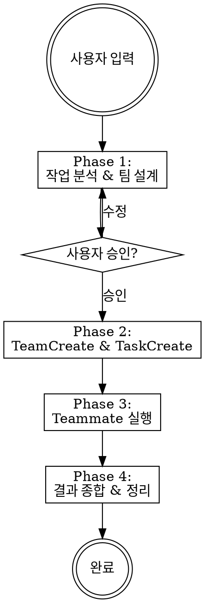

# Team Assemble

작업을 분석하여 전문가 팀을 동적으로 구성하고 TeamCreate 기반으로 즉시 실행하는 스킬.

## When to Use

- 독립적인 하위 작업 2개 이상으로 분해 가능한 복잡한 태스크
- 리서치 + 구현 + 검증처럼 역할 분리가 명확한 작업
- 병렬 실행으로 시간을 절약할 수 있는 작업

**사용하지 말 것:** 단일 파일 수정, 간단한 질문, 순차적으로만 가능한 작업

## Workflow



---

## Phase 1: 작업 분석 & 팀 설계

작업을 분석하여 다음을 결정:

1. **역할 분해** — 독립적인 하위 작업으로 분해하고 전문가 역할 부여
2. **모델 선택** — 역할별 최적 모델 배정
3. **의존성 그래프** — 선행 관계 결정

### 역할-모델 매핑

| 역할 유형 | 모델 | 예시 |
|-----------|------|------|
| 기획/설계/의사결정 | opus | architect, planner, lead |
| 분석/리서치/복잡한 판단 | opus | analyzer, researcher, code-reviewer |
| 구현/실행/수집 | sonnet | implementer, collector, writer |
| 검증/정리/포맷팅 | sonnet | validator, formatter, tester |

**경계 역할 판단**: "새로운 판단을 내려야 하는가?" → opus. "주어진 기준대로 실행하는가?" → sonnet.

### 팀 구성 제안

AskUserQuestion으로 반드시 승인을 받은 후 진행:

```
팀 구성 제안: {team-name}

| # | 역할 | 모델 | 담당 작업 | 의존성 |
|---|------|------|----------|--------|
| 1 | role-name | opus | 작업 설명 | - |
| 2 | role-name | sonnet | 작업 설명 | #1 |
```

Options: "좋아요, 실행해주세요" / "역할 수정이 필요해요"

"역할 수정" 선택 시 구체적으로 뭘 바꿀지 질문. 2회 이상 수정 요청 시 자유 텍스트 입력으로 전환.

---

## Phase 2: 팀 생성 & 태스크 분배

승인 후 순서대로 실행:

```
TeamCreate(team_name: "{keyword}-team", description: "작업 설명")
```

team_name 규칙: 작업 핵심 키워드 + `-team` (예: `migration-team`, `research-team`)

각 역할별 TaskCreate 호출 후 TaskUpdate로 blockedBy 의존성 설정:

```
TaskCreate(subject: "#1 {역할}: {작업 요약}", description: "상세 설명", activeForm: "{작업} 진행 중")
TaskUpdate(taskId: "2", addBlockedBy: ["1"])
```

---

## Phase 3: Teammate 실행

**핵심 메커니즘**: Task 도구는 foreground(기본)에서 **blocking** — teammate가 끝날 때까지 대기하고 결과 텍스트를 반환. 이 반환값이 teammate의 작업 결과.

### 병렬 실행

blockedBy가 없는 태스크들을 **단일 메시지에서 동시에** Task 호출:

```
Task(name: "analyst", team_name: "...", subagent_type: "general-purpose", model: "opus", prompt: "...", mode: "bypassPermissions")
Task(name: "collector", team_name: "...", subagent_type: "general-purpose", model: "sonnet", prompt: "...", mode: "bypassPermissions")
// 두 Task 완료 후 각각의 결과 텍스트 수신
```

### 순차 실행 (의존성)

선행 Task의 **반환값**을 다음 teammate 프롬프트에 삽입:

```
Task(name: "writer", prompt: "선행 작업 결과:\n{result_1}\n\n이 결과를 바탕으로...")
```

### Teammate 프롬프트 필수 요소

1. **맥락** — 전체 프로젝트와 이 작업의 관계
2. **구체적 목표** — 정확히 무엇을 달성해야 하는지
3. **제약조건** — 하지 말아야 할 것, 변경 범위 제한
4. **출력 형식** — 결과물 형태 (텍스트/파일/테이블)
5. **팀 정보** — team_name, task ID → TaskUpdate 완료 표시 지시

상세 프롬프트 템플릿은 **`references/prompt-templates.md`** 참조.

---

## Phase 4: 결과 종합 & 정리

### 결과 수집

모든 teammate 결과를 종합하여 사용자에게 보고:

```
## 팀 실행 결과: {team-name}
### 1. {역할}: {작업}  →  {결과 요약}
### 최종 산출물
- {파일 경로 또는 결과물 목록}
```

### 팀 정리

foreground Task 완료 후 teammate는 idle 상태. 정리 순서:

```
SendMessage(type: "shutdown_request", recipient: "{name}", content: "작업 완료")
TeamDelete()  // 모든 teammate 종료 확인 후
```

shutdown_request에 응답 없으면 이미 종료된 것 — 무시하고 TeamDelete 진행.

---

## Common Mistakes

| 실수 | 올바른 방법 |
|------|------------|
| 사용자 승인 없이 팀 생성 | Phase 1에서 반드시 AskUserQuestion으로 승인 |
| 모든 작업을 순차 실행 | 독립 작업은 단일 메시지에서 병렬 Task 호출 |
| teammate 프롬프트가 모호 | 맥락 + 목표 + 제약 + 출력형식 필수 포함 |
| TeamDelete 누락 | 반드시 shutdown_request → TeamDelete 순서로 정리 |
| 모든 역할에 opus 사용 | 실행/수집 역할은 sonnet으로 비용 절약 |

## Quick Reference

```
Phase 1: 분석 → AskUserQuestion (팀 구성 승인)
Phase 2: TeamCreate → TaskCreate × N → TaskUpdate (의존성)
Phase 3: Task × N (병렬) → 결과 전달 → Task × N (후속)
Phase 4: 결과 종합 → shutdown_request × N → TeamDelete
```

## Additional Resources

### Reference Files

- **`references/examples.md`** — DB 마이그레이션, 경쟁사 분석, 풀스택 구현 등 3개 worked example (전체 Phase 1~3 흐름)
- **`references/prompt-templates.md`** — 역할별 teammate 프롬프트 템플릿 (analyst, implementer, validator) 및 작성 팁
