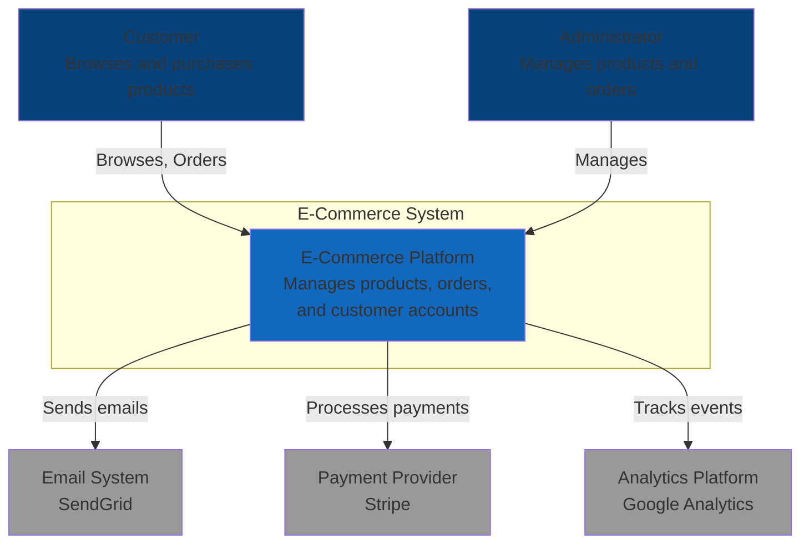

# C4 Context Diagram

## C4 Context Diagram

```mermaid
graph TB
    subgraph "E-Commerce System"
        System[E-Commerce Platform<br/>Manages products, orders,<br/>and customer accounts]
    end

    Customer[Customer<br/>Browses and purchases products]
    Admin[Administrator<br/>Manages products and orders]

    Email[Email System<br/>SendGrid]
    Payment[Payment Provider<br/>Stripe]
    Analytics[Analytics Platform<br/>Google Analytics]

    Customer -->|Browses, Orders| System
    Admin -->|Manages| System
    System -->|Sends emails| Email
    System -->|Processes payments| Payment
    System -->|Tracks events| Analytics

    style System fill:#1168bd
    style Customer fill:#08427b
    style Admin fill:#08427b
    style Email fill:#999
    style Payment fill:#999
    style Analytics fill:#999
```
