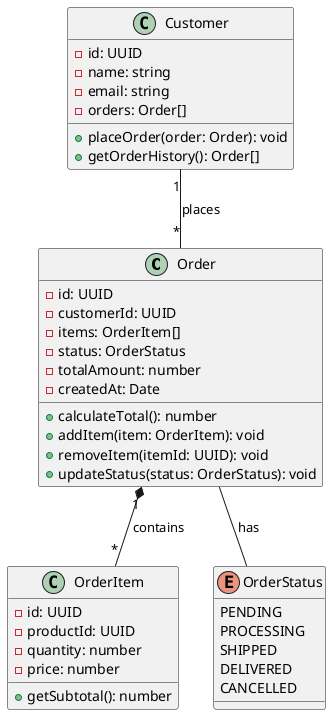

# Class Diagram

## Class Diagram

```plantuml
@startuml
class Order {
  -id: UUID
  -customerId: UUID
  -items: OrderItem[]
  -status: OrderStatus
  -totalAmount: number
  -createdAt: Date
  +calculateTotal(): number
  +addItem(item: OrderItem): void
  +removeItem(itemId: UUID): void
  +updateStatus(status: OrderStatus): void
}

class OrderItem {
  -id: UUID
  -productId: UUID
  -quantity: number
  -price: number
  +getSubtotal(): number
}

class Customer {
  -id: UUID
  -name: string
  -email: string
  -orders: Order[]
  +placeOrder(order: Order): void
  +getOrderHistory(): Order[]
}

enum OrderStatus {
  PENDING
  PROCESSING
  SHIPPED
  DELIVERED
  CANCELLED
}

Customer "1" -- "*" Order: places
Order "1" *-- "*" OrderItem: contains
Order -- OrderStatus: has
@enduml
```
