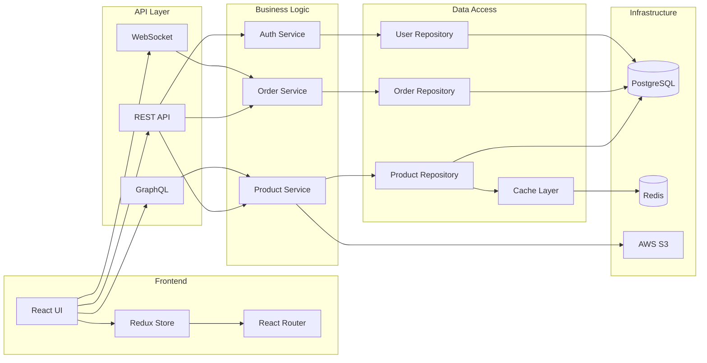

# Component Diagram

## Component Diagram

```mermaid
graph LR
    subgraph "Frontend"
        UI[React UI]
        Store[Redux Store]
        Router[React Router]
    end

    subgraph "API Layer"
        REST[REST API]
        WS[WebSocket]
        GQL[GraphQL]
    end

    subgraph "Business Logic"
        ProductSvc[Product Service]
        OrderSvc[Order Service]
        AuthSvc[Auth Service]
    end

    subgraph "Data Access"
        ProductRepo[Product Repository]
        OrderRepo[Order Repository]
        UserRepo[User Repository]
        Cache[Cache Layer]
    end

    subgraph "Infrastructure"
        DB[(PostgreSQL)]
        Redis[(Redis)]
        S3[AWS S3]
    end

    UI --> Store
    Store --> Router
    UI --> REST
    UI --> WS
    UI --> GQL

    REST --> ProductSvc
    REST --> OrderSvc
    REST --> AuthSvc
    WS --> OrderSvc
    GQL --> ProductSvc

    ProductSvc --> ProductRepo
    OrderSvc --> OrderRepo
    AuthSvc --> UserRepo

    ProductRepo --> DB
    OrderRepo --> DB
    UserRepo --> DB
    ProductRepo --> Cache
    Cache --> Redis
    ProductSvc --> S3
```
