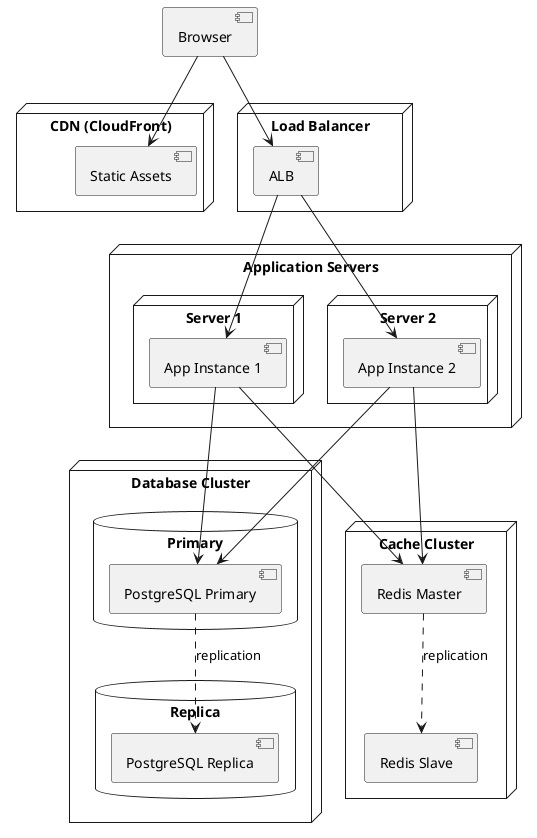

# Deployment Diagram

## Deployment Diagram

```plantuml
@startuml
node "CDN (CloudFront)" {
  [Static Assets]
}

node "Load Balancer" {
  [ALB]
}

node "Application Servers" {
  node "Server 1" {
    [App Instance 1]
  }
  node "Server 2" {
    [App Instance 2]
  }
}

node "Database Cluster" {
  database "Primary" {
    [PostgreSQL Primary]
  }
  database "Replica" {
    [PostgreSQL Replica]
  }
}

node "Cache Cluster" {
  [Redis Master]
  [Redis Slave]
}

[Browser] --> [Static Assets]
[Browser] --> [ALB]
[ALB] --> [App Instance 1]
[ALB] --> [App Instance 2]
[App Instance 1] --> [PostgreSQL Primary]
[App Instance 2] --> [PostgreSQL Primary]
[PostgreSQL Primary] ..> [PostgreSQL Replica]: replication
[App Instance 1] --> [Redis Master]
[App Instance 2] --> [Redis Master]
[Redis Master] ..> [Redis Slave]: replication
@enduml
```
