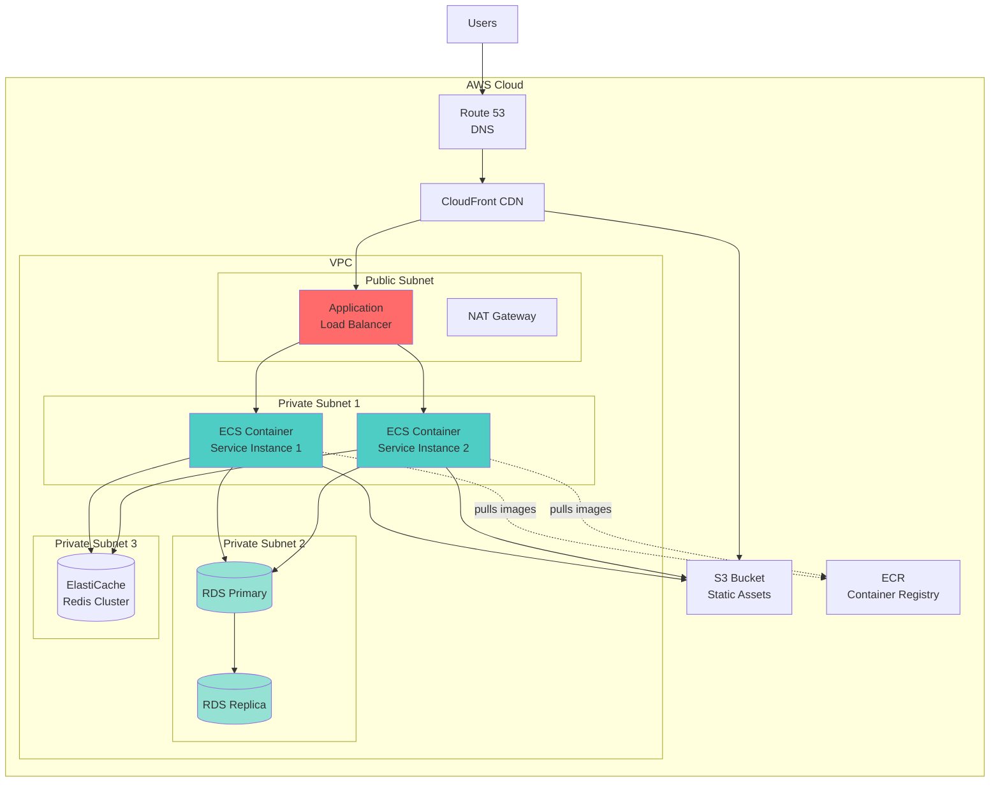

# Deployment Diagram

## Deployment Diagram

```mermaid
graph TB
    subgraph "AWS Cloud"
        subgraph "VPC"
            subgraph "Public Subnet"
                ALB[Application<br/>Load Balancer]
                NAT[NAT Gateway]
            end

            subgraph "Private Subnet 1"
                ECS1[ECS Container<br/>Service Instance 1]
                ECS2[ECS Container<br/>Service Instance 2]
            end

            subgraph "Private Subnet 2"
                RDS1[(RDS Primary)]
                RDS2[(RDS Replica)]
            end

            subgraph "Private Subnet 3"
                ElastiCache[(ElastiCache<br/>Redis Cluster)]
            end
        end

        Route53[Route 53<br/>DNS]
        CloudFront[CloudFront CDN]
        S3[S3 Bucket<br/>Static Assets]
        ECR[ECR<br/>Container Registry]
    end

    Users[Users] --> Route53
    Route53 --> CloudFront
    CloudFront --> ALB
    CloudFront --> S3
    ALB --> ECS1
    ALB --> ECS2
    ECS1 --> RDS1
    ECS2 --> RDS1
    RDS1 --> RDS2
    ECS1 --> ElastiCache
    ECS2 --> ElastiCache
    ECS1 --> S3
    ECS2 --> S3
    ECS1 -.pulls images.-> ECR
    ECS2 -.pulls images.-> ECR

    style ALB fill:#ff6b6b
    style ECS1 fill:#4ecdc4
    style ECS2 fill:#4ecdc4
    style RDS1 fill:#95e1d3
    style RDS2 fill:#95e1d3
```
