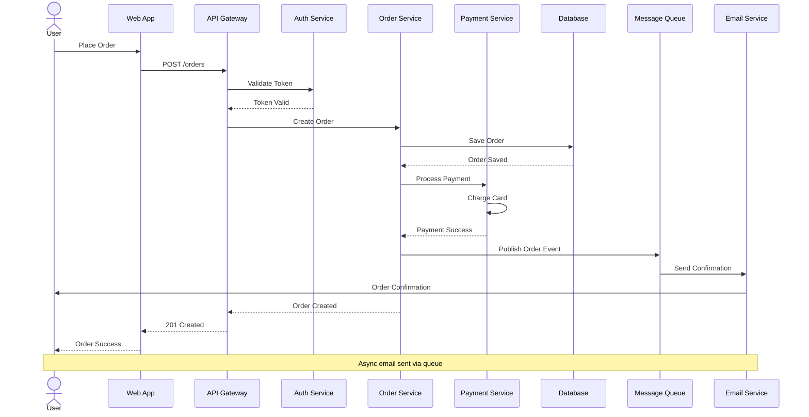

# Sequence Diagram

## Sequence Diagram

```mermaid
sequenceDiagram
    actor User
    participant Web as Web App
    participant Gateway as API Gateway
    participant Auth as Auth Service
    participant Order as Order Service
    participant Payment as Payment Service
    participant DB as Database
    participant Queue as Message Queue
    participant Email as Email Service

    User->>Web: Place Order
    Web->>Gateway: POST /orders
    Gateway->>Auth: Validate Token
    Auth-->>Gateway: Token Valid

    Gateway->>Order: Create Order
    Order->>DB: Save Order
    DB-->>Order: Order Saved
    Order->>Payment: Process Payment
    Payment->>Payment: Charge Card
    Payment-->>Order: Payment Success
    Order->>Queue: Publish Order Event
    Queue->>Email: Send Confirmation
    Email->>User: Order Confirmation

    Order-->>Gateway: Order Created
    Gateway-->>Web: 201 Created
    Web-->>User: Order Success

    Note over User,Email: Async email sent via queue
```
