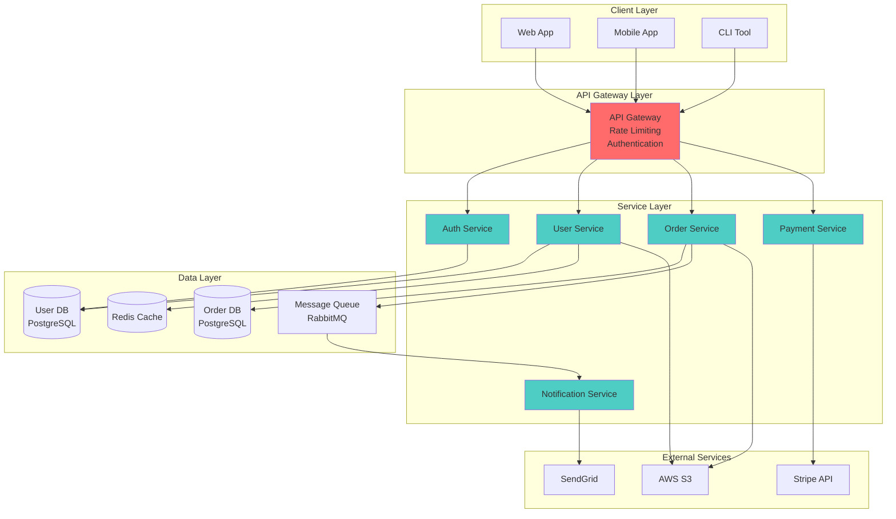

# System Architecture Diagram

## System Architecture Diagram

```mermaid
graph TB
    subgraph "Client Layer"
        Web[Web App]
        Mobile[Mobile App]
        CLI[CLI Tool]
    end

    subgraph "API Gateway Layer"
        Gateway[API Gateway<br/>Rate Limiting<br/>Authentication]
    end

    subgraph "Service Layer"
        Auth[Auth Service]
        User[User Service]
        Order[Order Service]
        Payment[Payment Service]
        Notification[Notification Service]
    end

    subgraph "Data Layer"
        UserDB[(User DB<br/>PostgreSQL)]
        OrderDB[(Order DB<br/>PostgreSQL)]
        Cache[(Redis Cache)]
        Queue[Message Queue<br/>RabbitMQ]
    end

    subgraph "External Services"
        Stripe[Stripe API]
        SendGrid[SendGrid]
        S3[AWS S3]
    end

    Web --> Gateway
    Mobile --> Gateway
    CLI --> Gateway

    Gateway --> Auth
    Gateway --> User
    Gateway --> Order
    Gateway --> Payment

    Auth --> UserDB
    User --> UserDB
    User --> Cache
    Order --> OrderDB
    Order --> Queue
    Payment --> Stripe
    Queue --> Notification
    Notification --> SendGrid

    Order --> S3
    User --> S3

    style Gateway fill:#ff6b6b
    style Auth fill:#4ecdc4
    style User fill:#4ecdc4
    style Order fill:#4ecdc4
    style Payment fill:#4ecdc4
    style Notification fill:#4ecdc4
```
