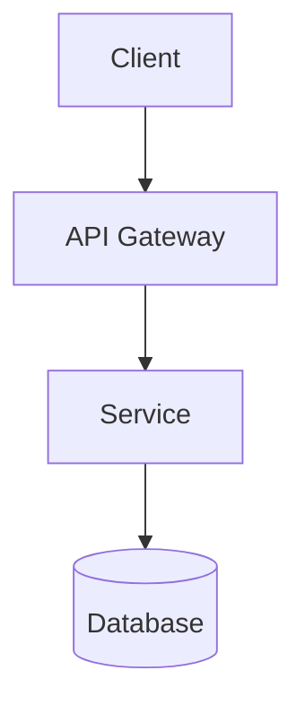
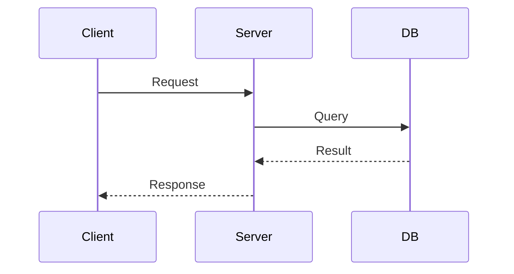
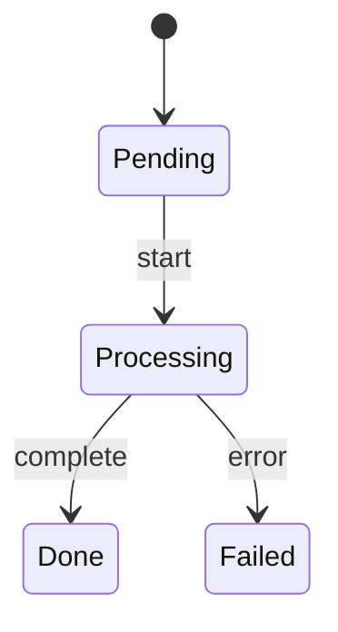

# Technical Design Document Template

```markdown
# [Feature/System Name] Technical Design

## TL;DR
- 3-5 bullets: problem, solution, key decisions, expected outcome

## Background (Medium/Large)

### Current State
- Existing behavior and limitations

### Problem Statement
- What breaks if we do nothing?
- Who is affected and how?

### Goals / Non-Goals
- Goals: what this design achieves
- Non-Goals: explicitly out of scope

## Solution Analysis (Medium/Large)

### Option 1: [Name]
Pros: ...
Cons: ...

### Option 2: [Name]
Pros: ...
Cons: ...

### Comparison
| Criteria | Option 1 | Option 2 |
|----------|----------|----------|
| Performance | ... | ... |
| Complexity | ... | ... |

### Recommendation
Selected: Option X
Rationale: [why]

## Detailed Design

### Architecture
[Mermaid diagram - see examples below]

### Component Design
- Responsibilities
- Interfaces
- Dependencies

### Data Model (if applicable)
[Schema or structure]

### API Design (if applicable)
[Endpoints, request/response]

## Implementation Plan

### Phase 1: [Name]
- [ ] Task 1
- [ ] Task 2

### Migration Strategy (if applicable)

## Risk Assessment

| Risk | Probability | Impact | Mitigation |
|------|-------------|--------|------------|
| ... | High/Med/Low | High/Med/Low | ... |

## References
- Related docs, external resources
```

## Mermaid Diagram Examples

**Architecture (flowchart):**


**Sequence:**


**State:**

