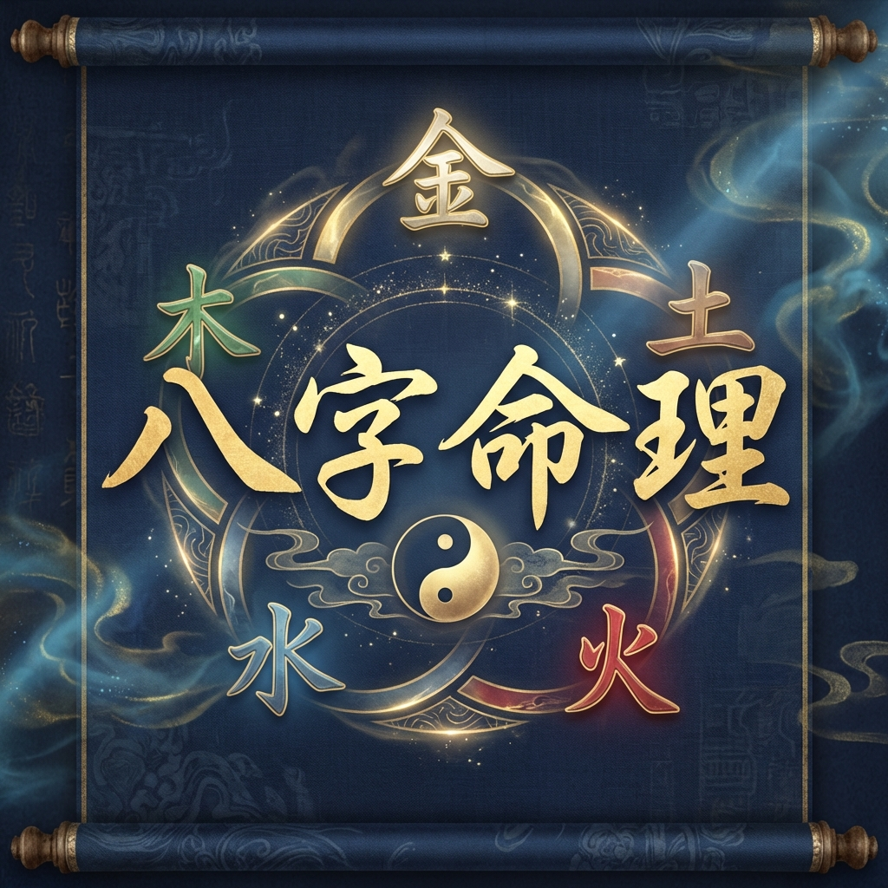

# 八字命理 Bazi Mingli




[繁體中文](README.md) | [English](README_EN.md)

八字命理（四柱推命 / Bazi / Four Pillars of Destiny）是中國傳統命理學的核心體系。本專案提供專業的八字命理技能，適用於 Claude、ChatGPT、Gemini、DeepSeek 等 AI/LLM。

## 什麼是八字命理？

八字命理，又稱「四柱推命」，是根據一個人出生的年、月、日、時，推算出四組天干地支（共八個字），據此分析人的命運、運勢與性格的傳統學問。

### 核心概念

- **四柱**：年柱、月柱、日柱、時柱，各由一天干一地支組成
- **天干**：甲、乙、丙、丁、戊、己、庚、辛、壬、癸（10個）
- **地支**：子、丑、寅、卯、辰、巳、午、未、申、酉、戌、亥（12個）
- **五行**：金、木、水、火、土
- **十神**：比肩、劫財、食神、傷官、偏財、正財、七殺、正官、偏印、正印

### 為什麼使用八字命理？

1. **自我了解**：認識自己的優勢與挑戰
2. **運勢預測**：掌握人生的高潮與低谷期
3. **決策參考**：重大決定時的輔助工具
4. **擇時擇日**：選擇有利的時機行事
5. **人際關係**：理解與他人的互動模式

## 功能特色

### 排盤功能

- ✅ 四柱八字排盤
- ✅ 農曆/西曆自動轉換
- ✅ 節氣精確判斷
- ✅ 藏干計算
- ✅ 十神配置

### 分析功能

- ✅ 五行分布統計
- ✅ 日主強弱判斷
- ✅ 用神喜忌推斷
- ✅ 大運流年排列
- ✅ 格局分析

### 專項解讀

- ✅ 事業財運分析
- ✅ 婚姻感情分析
- ✅ 健康養生建議
- ✅ 流年運勢預測

## 專案結構

```
bazi-mingli/
├── SKILL.md              ← 核心技能指南（必讀）
├── ETHICS.md             ← 倫理準則
├── README.md             ← 本文件
├── references/
│   ├── tiangan-dizhi.md      ← 天干地支基礎
│   ├── wuxing-shengke.md     ← 五行生剋詳解
│   ├── shishen.md            ← 十神定義與應用
│   ├── rizhu-qiangruo.md     ← 日主強弱判斷
│   ├── yongshen.md           ← 用神喜忌法則
│   ├── dayun-liunian.md      ← 大運流年推算
│   ├── hunyin-ganqing.md     ← 婚姻感情專論
│   ├── shiye-caiyun.md       ← 事業財運專論
│   ├── jiankang.md           ← 健康疾病專論
│   └── geju-fenxi.md         ← 格局分析總論
└── scripts/
    └── bazi_calc.py          ← Python 計算工具
```

## 使用方式

### 作為 AI Skill 安裝

**簡易方式**：在 Claude Code 中貼上此 URL 並說「請安裝這個技能」：

```
https://github.com/your-username/bazi-mingli
```

**手動安裝**：

```bash
# 個人技能（跨專案使用）
git clone https://github.com/your-username/bazi-mingli.git ~/.claude/skills/bazi-mingli

# 或特定專案使用
git clone https://github.com/your-username/bazi-mingli.git .claude/skills/bazi-mingli
```

安裝後，使用「八字」「排盤」「算命」等關鍵詞即可啟用技能。

### 使用 Python 工具

```bash
# 以西曆日期排盤
python scripts/bazi_calc.py 1990 8 15 14 男

# 以當前時間排盤
python scripts/bazi_calc.py
```

## 觸發詞

當用戶使用以下詞彙時，技能會自動啟用：

- 八字、四柱、命盤、排盤
- 算命、命理、生辰八字
- 天干地支、五行、十神
- 流年、大運、運勢

## 範例對話

**用戶**：幫我排八字，我是 1990 年 8 月 15 日下午 2 點出生的男性

**AI**：好的，讓我為您排出八字命盤...

（AI 會根據 SKILL.md 的指南進行排盤和解讀）

## 倫理準則

本技能遵循嚴格的倫理準則：

- **中立客觀**：吉凶並陳，不迎合期望
- **責任界限**：僅供參考，不替代專業諮詢
- **語言規範**：使用「可能」「傾向」等非絕對用語
- **尊重隱私**：未經同意不分析他人命盤
- **心理關懷**：遇到心理脆弱者提供適當支持

詳見 [ETHICS.md](ETHICS.md)

## 參考資料

- 《淵海子平》
- 《滴天髓》
- 《三命通會》
- 《窮通寶鑒》
- 《子平真詮》

## 授權

CC BY-NC-SA 4.0

---

> 「命由天定，運由己造。」
> 
> 八字命理的真諦在於了解自己，而非預定命運。
