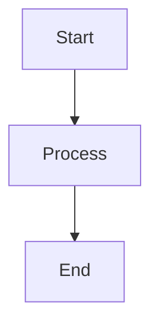
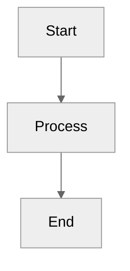
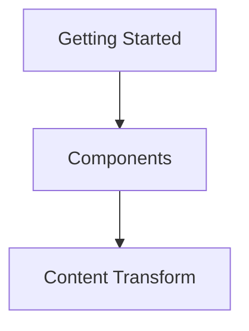
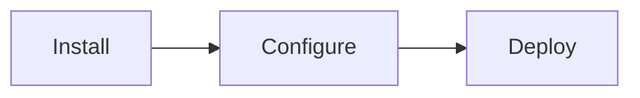
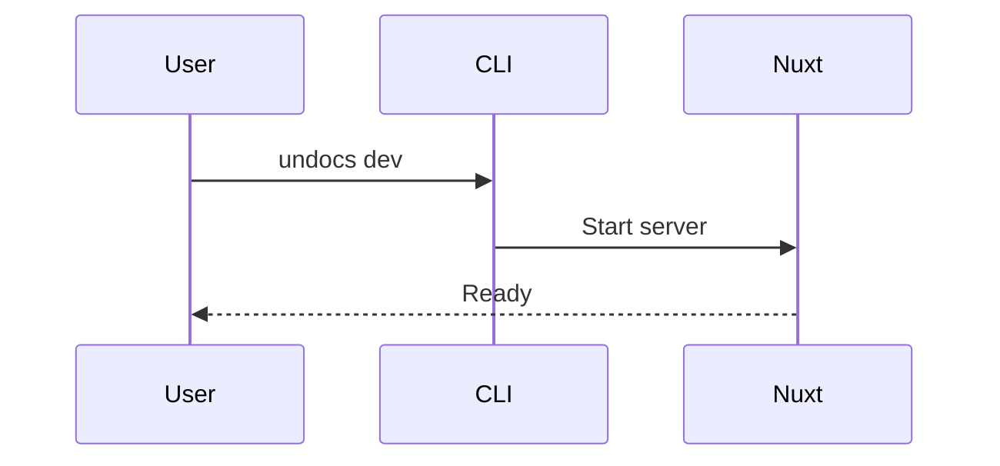

# Mermaid Diagrams

Undocs supports Mermaid diagrams for creating flowcharts, sequence diagrams, and other visualizations.

## Basic Usage

Use standard markdown code blocks with `mermaid` language:

````markdown

````

## Theme Configuration

Configure the theme using Mermaid initialization:

````markdown

````

## Interactive Diagrams

Add click handlers to make diagrams interactive:

````markdown

````

## Supported Diagram Types

Mermaid supports various diagram types:

- Flowcharts (`graph`, `flowchart`)
- Sequence diagrams (`sequenceDiagram`)
- Class diagrams (`classDiagram`)
- State diagrams (`stateDiagram`)
- Entity relationship diagrams (`erDiagram`)
- User journey (`journey`)
- Gantt charts (`gantt`)
- Pie charts (`pie`)
- Git graphs (`gitGraph`)

## Usage Examples

### Flowchart

````markdown

````

### Sequence Diagram

````markdown

````

## Key Points

- Use standard markdown code blocks with `mermaid` language
- Theme can be configured using Mermaid initialization syntax
- Supports click handlers for interactive navigation
- Diagrams are rendered client-side using Mermaid.js
- All standard Mermaid diagram types are supported

<!--
Source references:
- https://undocs.unjs.io/guide/components/components
- https://mermaid.js.org/
-->
