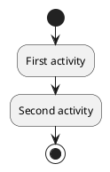
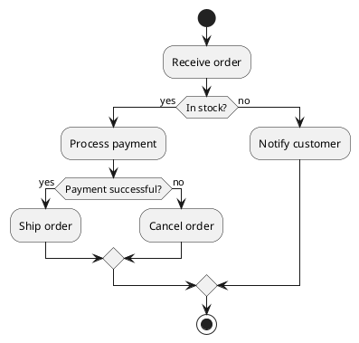
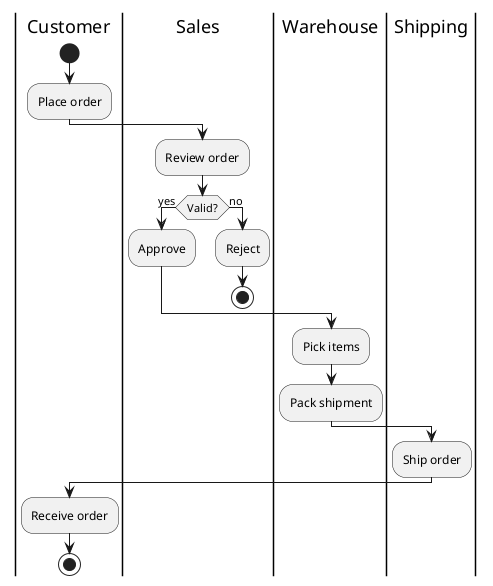
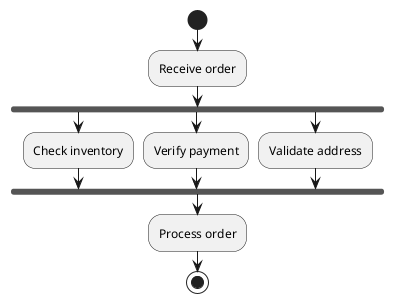

# Activity Diagram Syntax

Activity diagrams show workflows and processes.

## Basic Syntax



## Conditions



## Swimlanes



## Fork and Join



## Complete Example

```plantuml
@startuml
title Order Processing Workflow

| #LightBlue | Customer |
start
:Submit order;

| #LightGreen | System |
:Validate order;

if (Valid order?) then (yes)
    fork
        :Check inventory;
    fork again
        :Verify payment;
    end fork

    if (All checks pass?) then (yes)
| #LightYellow | Warehouse |
        :Reserve items;
        :Generate packing slip;

| #LightPink | Shipping |
        :Schedule pickup;
        :Update tracking;

| #LightBlue | Customer |
        :Receive confirmation;
    else (no)
| #LightGreen | System |
        :Send failure notification;
| #LightBlue | Customer |
        :Receive rejection;
    endif
else (no)
| #LightBlue | Customer |
    :Show validation errors;
endif

stop
@enduml
```
