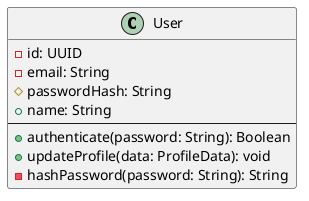
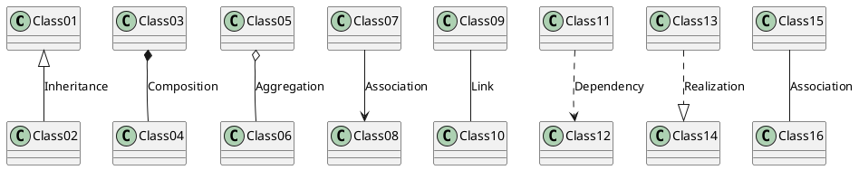
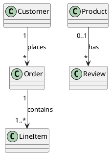
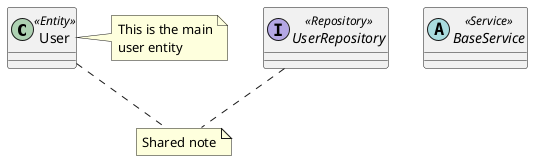
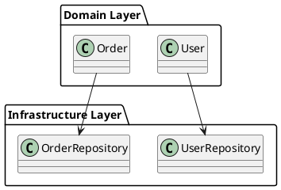
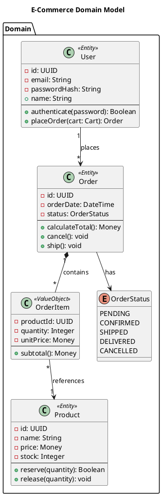

# Class Diagram Syntax

Class diagrams show object-oriented structures.

## Class Definition

## Visibility Modifiers

| Symbol | Meaning |
| --- | --- |
| `-` | Private |
| `+` | Public |
| `#` | Protected |
| `~` | Package |

## Relationships

| Symbol | Relationship |
| --- | --- |
| `<\|--` | Inheritance (extends) |
| `*--` | Composition (contains, lifecycle bound) |
| `o--` | Aggregation (contains, independent lifecycle) |
| `-->` | Association (uses) |
| `..>` | Dependency (uses temporarily) |
| `..\|>` | Realization (implements) |

## Cardinality

## Stereotypes and Notes

## Packages and Namespaces

## Complete Example

