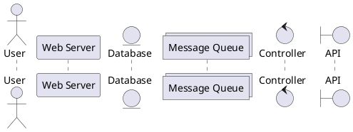
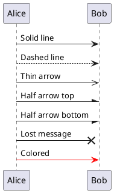
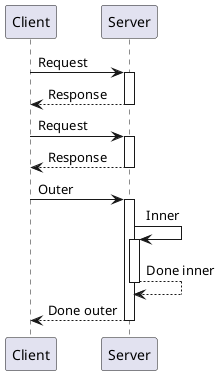
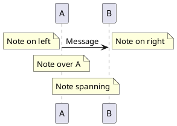
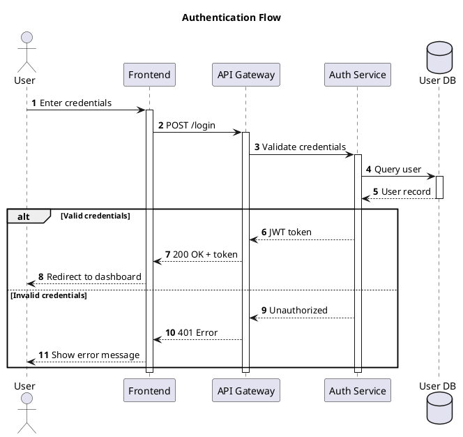

# Sequence Diagram Syntax

Sequence diagrams show interactions between participants.

## Participants



| Keyword | Shape |
| --- | --- |
| `participant` | Rectangle (default) |
| `actor` | Stick figure |
| `boundary` | Circle with line |
| `control` | Circle with arrow |
| `entity` | Circle with underline |
| `database` | Cylinder |
| `collections` | Stacked rectangles |
| `queue` | Queue shape |

## Arrow Types



## Activation and Lifelines



## Groups, Loops, and Alternatives

```plantuml
@startuml
participant User
participant API
participant DB

User -> API: Request

alt Success Case
    API -> DB: Query
    DB --> API: Data
    API --> User: 200 OK
else Failure Case
    API --> User: 500 Error
end

loop Every 5 seconds
    API -> DB: Health check
end

opt Optional Step
    API -> API: Log request
end

par Parallel Execution
    API -> Service1: Call 1
and
    API -> Service2: Call 2
end

critical Critical Section
    API -> DB: Transaction
end
@enduml
```

## Notes



## Complete Example


