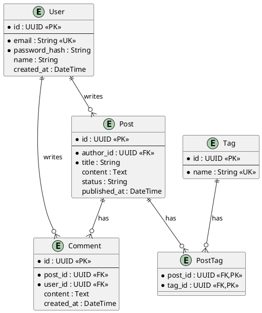
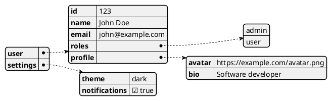
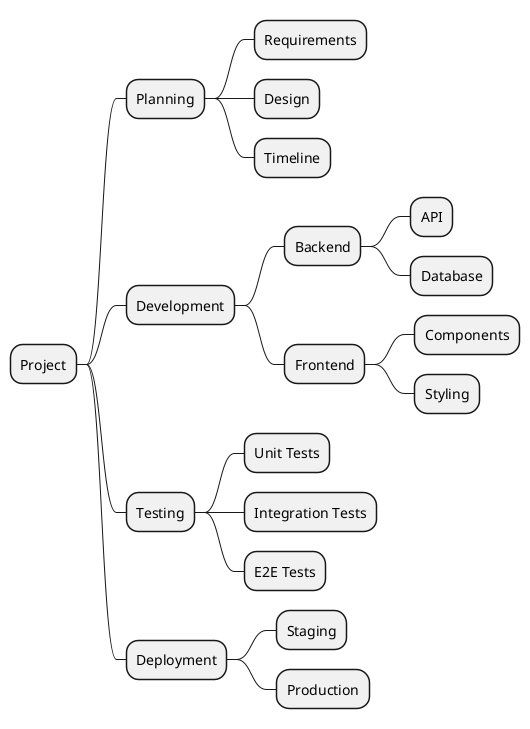
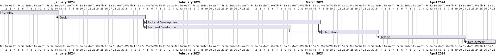
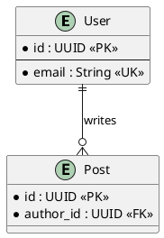
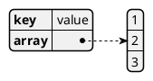
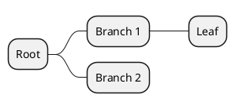
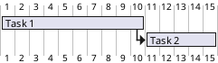

# Special Diagram Types

Non-UML diagram types supported by PlantUML.

## Entity Relationship Diagram

---

## JSON Visualization

---

## MindMap

---

## Gantt Chart

---

## Quick Reference

### ER

### JSON

### MindMap

### Gantt

