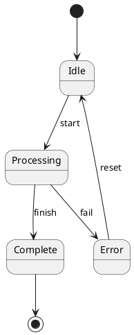
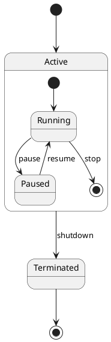
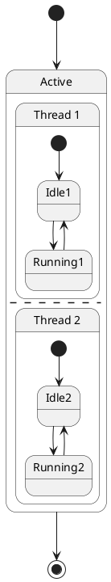
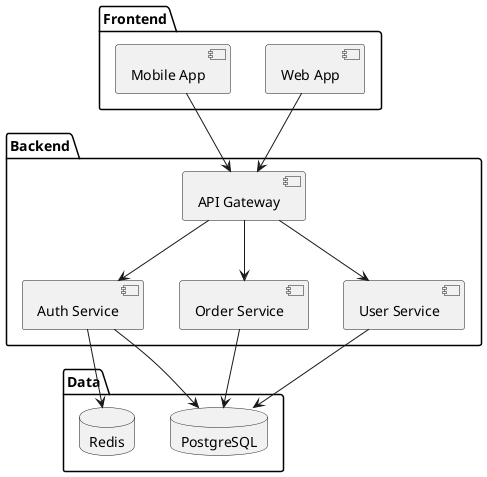
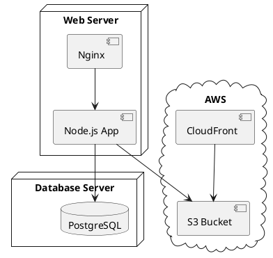

# State and Component Diagrams

## State Diagram Syntax

State diagrams show state machines.

### Basic Syntax

### Composite States

### Concurrent States

---

## Component Diagram Syntax

Component diagrams show system structure.

---

## Deployment Diagram Syntax

Deployment diagrams show infrastructure.

