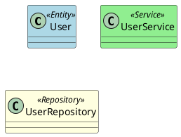

# Styling and Setup

## Skinparams

```plantuml
@startuml
skinparam backgroundColor #EEEEEE
skinparam classFontColor #333333
skinparam classFontSize 14
skinparam classFontName Arial
skinparam classBackgroundColor #FFFFFF
skinparam classBorderColor #333333
skinparam classArrowColor #333333

class MyClass {
    +attribute: String
    +method(): void
}
@enduml
```



## Built-in Themes


## Custom Colors



---

## Setup Options

### Local Installation

1. **Install Java JRE** (required)
2. **Install GraphViz** (for some diagram types)
   - Windows: `choco install graphviz`
   - macOS: `brew install graphviz`
   - Linux: `apt install graphviz`
3. **Download PlantUML JAR** from plantuml.com
4. **Run:** `java -jar plantuml.jar diagram.puml`

### Docker (Recommended)

```bash
docker run -d -p 8080:8080 plantuml/plantuml-server:jetty
```

Access at: <http://localhost:8080>

### VS Code Extension

Install "PlantUML" extension, configure server URL in settings:

```json
{
    "plantuml.server": "http://localhost:8080"
}
```

---

## File Extensions

| Extension | Description |
| --- | --- |
| `.puml` | Standard PlantUML file |
| `.plantuml` | Alternative extension |
| `.pu` | Short extension |
| `.iuml` | Include file |
