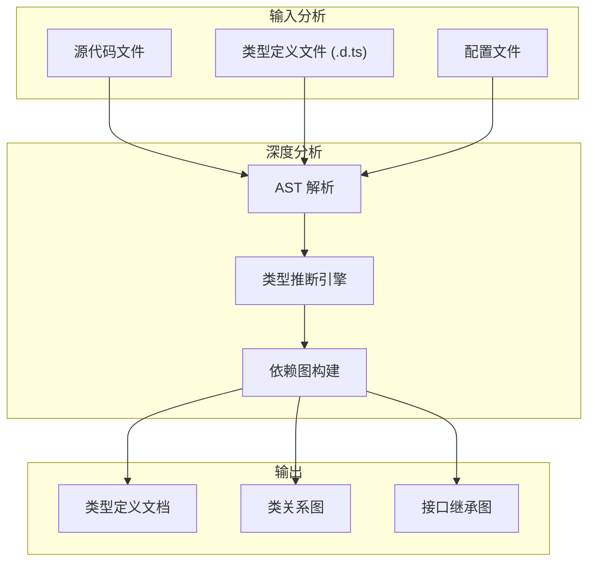
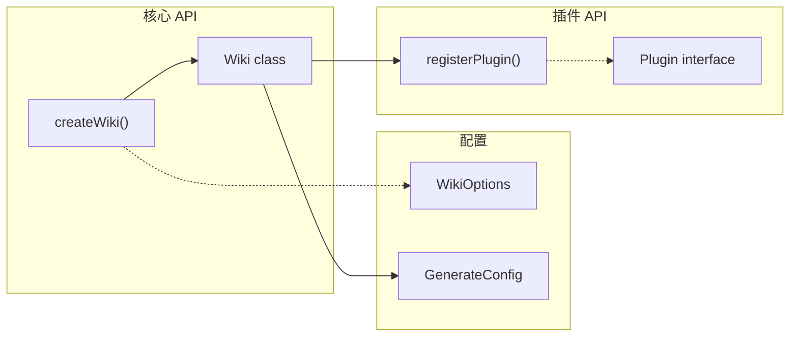
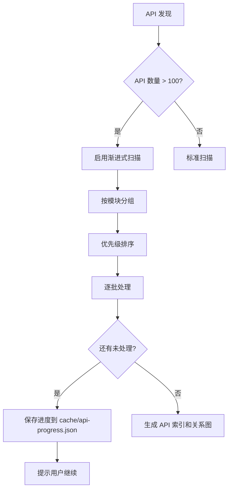

# API Doc Enhancer / API 文档增强器

> **核心理念**：生成的 API 文档必须达到 **TypeDoc / Sphinx / JavaDoc** 级别的专业标准。

自动从代码中进行**深度语义分析**，提取注释、类型定义、函数签名、使用模式和错误处理，生成**结构化、可导航、有示例**的专业 API 文档。

## 核心设计原则 / Core Principles

1. **深度而非表面**：不仅提取签名，还要理解函数的**目的、副作用、边界条件**
2. **示例驱动**：每个 API 必须有 **3 个以上**的使用示例（基础、进阶、错误处理）
3. **关联成网**：API 之间通过**交叉引用**形成知识网络
4. **类型可视化**：复杂类型使用 **Mermaid 类图**展示

## 功能特性 / Features

### 1. 深度注释提取 / Deep Comment Extraction

自动识别和提取多种注释格式，并进行**语义增强**：

| 语言 | 支持的格式 | 提取内容 |
|------|-----------|----------|
| JavaScript/TypeScript | JSDoc (`/** ... */`) | @param, @returns, @throws, @example, @see, @deprecated |
| Python | docstring (`"""..."""`) | Args, Returns, Raises, Examples, Notes, Warnings |
| Go | GoDoc comments | 参数、返回值、错误、示例 |
| Rust | `///` 和 `//!` 文档注释 | 参数、返回值、Panics、Safety、Examples |
| Java | Javadoc | @param, @return, @throws, @see, @since |

**语义增强**：即使代码注释不完善，也会基于代码分析**自动补充**：
- 参数类型和约束
- 可能的返回值情况
- 潜在的异常/错误
- 典型使用场景

### 2. 类型系统分析 / Type System Analysis



**类型分析能力**：
- **TypeScript**: 提取 interfaces, types, enums, generics, conditional types
- **Python**: 解析 type hints, TypedDict, Protocol, Generic
- **Go**: 分析 struct, interface, type alias
- **Rust**: 提取 struct, enum, trait, impl blocks

### 3. 智能示例生成 / Intelligent Example Generation

根据 API 签名和上下文**自动生成多层次示例**：

| 示例类型 | 说明 | 自动生成 |
|---------|------|----------|
| 🟢 基础用法 | 最简调用方式 | ✅ |
| 🟡 进阶用法 | 使用可选参数和高级特性 | ✅ |
| 🔴 错误处理 | 展示异常捕获和边界情况 | ✅ |
| 🔵 集成示例 | 与其他 API 配合使用 | ⚙️ 需上下文 |

### 4. API 关系图谱 / API Relationship Graph



### 5. 变更追踪 / Change Tracking

- **@since** 标签自动提取，生成版本矩阵
- **@deprecated** 检测，生成迁移指南
- 与 Git 历史结合，显示 API 引入版本

## Hooks

### after_analyze (深度代码分析)

分析阶段后，进行深度源代码扫描：

1. **AST 解析**：构建完整的抽象语法树
2. **符号提取**：识别所有导出的函数、类、接口、类型
3. **注释解析**：提取并结构化 JSDoc/docstring 注释
4. **类型解析**：解析完整的类型定义和泛型约束
5. **依赖分析**：构建 API 间的调用关系图
6. **使用模式识别**：从测试文件和示例代码中提取使用模式
7. 保存到 `cache/api-analysis.json`

**输出数据结构**：
```yaml
# cache/api-analysis.json
modules:
  - name: "wiki"
    path: "src/wiki.ts"
    exports:
      functions:
        - name: "createWiki"
          signature: "(options: WikiOptions) => Promise<Wiki>"
          description: "创建新的 Wiki 实例"
          params:
            - name: "options"
              type: "WikiOptions"
              required: true
              description: "Wiki 配置选项"
              constraints: ["title 不能为空"]
          returns:
            type: "Promise<Wiki>"
            description: "Wiki 实例"
            cases:
              - condition: "成功"
                value: "Wiki 实例"
              - condition: "配置无效"
                value: "抛出 ValidationError"
          throws:
            - type: "ValidationError"
              condition: "title 为空或无效"
          examples: [...]
          related: ["Wiki", "WikiOptions", "generateDocs"]
          since: "1.0.0"
          source:
            file: "src/wiki.ts"
            line: 42
```

### before_generate (文档模板准备)

生成前准备专业级 API 文档模板：

1. **模块分组**：按功能域组织 API
2. **签名格式化**：生成语法高亮的函数签名
3. **参数表格**：构建完整的参数文档表格
4. **类型展开**：展开复杂类型定义
5. **示例生成**：为缺少示例的 API 自动生成示例
6. **关系图生成**：生成 API 依赖关系的 Mermaid 图

### after_generate (文档增强)

生成后进行专业级增强：

1. **源码链接**：添加精确的源码位置链接 `[📄](file:///path#L42)`
2. **类型关系图**：生成 Mermaid classDiagram
3. **交叉引用**：添加 "See Also" 和 "Related APIs" 链接
4. **导航生成**：生成 API 索引和快速导航
5. **搜索索引**：生成 API 搜索元数据

## 配置 / Configuration

在 `.mini-wiki/config.yaml` 中添加专业配置：

```yaml
plugins:
  api-doc-enhancer:
    # 启用的语言
    languages:
      - typescript
      - python
      - go
    
    # 分析深度
    analysis_depth: deep  # shallow | standard | deep
    
    # 示例生成
    examples:
      enabled: true
      min_per_api: 3           # 每个 API 最少示例数
      include_error_handling: true
      include_edge_cases: true
    
    # 类型文档
    types:
      expand_complex: true     # 展开复杂类型
      generate_diagrams: true  # 生成类型关系图
      include_internal: false  # 是否包含内部类型
    
    # 可见性控制
    visibility:
      include_private: false
      include_internal: false
      include_deprecated: true
      deprecation_notice: true
    
    # 输出格式
    output:
      group_by: module         # module | category | alphabet
      include_toc: true
      include_search_index: true
      source_links: true
    
    # 关系图
    diagrams:
      api_relationships: true
      type_hierarchies: true
      call_graphs: false       # 性能考虑，默认关闭
```

## 输出示例 / Output Example

### 完整的 API 文档页面

```markdown
# API Reference: wiki

> Wiki 核心模块，提供 Wiki 实例创建和管理功能。

---

## 📋 模块概览

| 统计 | 数量 |
|------|------|
| 函数 | 5 |
| 类 | 2 |
| 接口 | 3 |
| 类型 | 4 |

### 导入方式

​```typescript
// ESM
import { createWiki, Wiki, WikiOptions } from 'mini-wiki';

// CommonJS
const { createWiki, Wiki, WikiOptions } = require('mini-wiki');
​```

---

## 🔗 API 关系图

​```mermaid
classDiagram
    class Wiki {
        +config: WikiConfig
        +generate(): Promise~void~
        +update(): Promise~void~
    }
    
    class WikiOptions {
        <<interface>>
        +title: string
        +language?: string
        +plugins?: Plugin[]
    }
    
    class WikiConfig {
        <<type>>
        +generation: GenerationConfig
        +exclude: string[]
    }
    
    WikiOptions --> Wiki : creates
    Wiki --> WikiConfig : uses
​```

---

## 📦 类型定义

### `WikiOptions`

Wiki 创建选项接口。

​```typescript
interface WikiOptions {
  /** Wiki 标题（必填） */
  title: string;
  
  /** 文档语言，默认 'en' */
  language?: 'zh' | 'en' | 'both';
  
  /** 启用的插件列表 */
  plugins?: Plugin[];
  
  /** 排除的文件模式 */
  exclude?: string[];
}
​```

| 属性 | 类型 | 必需 | 默认值 | 描述 |
|------|------|------|--------|------|
| `title` | `string` | ✅ | - | Wiki 标题，将显示在首页和导航中 |
| `language` | `'zh' \| 'en' \| 'both'` | ❌ | `'en'` | 生成文档的语言 |
| `plugins` | `Plugin[]` | ❌ | `[]` | 启用的插件列表 |
| `exclude` | `string[]` | ❌ | `[]` | 排除的文件 glob 模式 |

---

## ⚡ 函数

### `createWiki(options)`

创建新的 Wiki 实例。

这是 mini-wiki 的主要入口函数，用于初始化一个新的 Wiki 生成器实例。
该函数会验证配置选项，初始化缓存系统，并加载所有启用的插件。

**函数签名**

​```typescript
function createWiki(options: WikiOptions): Promise<Wiki>
​```

**参数**

| 名称 | 类型 | 必需 | 默认值 | 描述 |
|------|------|------|--------|------|
| `options` | `WikiOptions` | ✅ | - | Wiki 配置选项对象 |
| `options.title` | `string` | ✅ | - | Wiki 标题，不能为空字符串 |
| `options.language` | `'zh' \| 'en' \| 'both'` | ❌ | `'en'` | 目标语言 |
| `options.plugins` | `Plugin[]` | ❌ | `[]` | 要加载的插件 |

**返回值**

`Promise<Wiki>` - 返回一个 Promise，resolve 为初始化完成的 Wiki 实例。

| 情况 | 返回值 |
|------|--------|
| 成功 | `Wiki` 实例，可调用 `generate()` 开始生成 |
| 配置无效 | 抛出 `ValidationError` |
| 目录不存在 | 抛出 `FileSystemError` |

**异常**

| 异常类型 | 触发条件 | 处理建议 |
|---------|---------|----------|
| `ValidationError` | `title` 为空或包含非法字符 | 检查 title 参数 |
| `FileSystemError` | 项目目录不存在或无权限 | 检查路径和权限 |
| `PluginError` | 插件加载失败 | 检查插件配置 |

**示例**

🟢 **基础用法**

​```typescript
import { createWiki } from 'mini-wiki';

const wiki = await createWiki({
  title: 'My Project'
});

await wiki.generate();
// 输出: Wiki 已生成到 .mini-wiki/wiki/
​```

🟡 **进阶用法 - 多语言和插件**

​```typescript
import { createWiki } from 'mini-wiki';
import { apiDocEnhancer, diagramPlus } from 'mini-wiki/plugins';

const wiki = await createWiki({
  title: '我的项目',
  language: 'both',  // 生成中英文文档
  plugins: [apiDocEnhancer(), diagramPlus()],
  exclude: ['**/*.test.ts', 'node_modules/**']
});

// 增量更新（仅处理变更文件）
await wiki.update();
​```

🔴 **错误处理**

​```typescript
import { createWiki, ValidationError, FileSystemError } from 'mini-wiki';

try {
  const wiki = await createWiki({
    title: '',  // 无效：空标题
  });
} catch (error) {
  if (error instanceof ValidationError) {
    console.error('配置验证失败:', error.message);
    console.error('问题字段:', error.field);  // 'title'
  } else if (error instanceof FileSystemError) {
    console.error('文件系统错误:', error.message);
  } else {
    throw error;  // 未知错误，继续抛出
  }
}
​```

**⚠️ 注意事项**

- 首次调用会创建 `.mini-wiki/` 目录结构
- 如果已存在 Wiki，将进行增量更新
- 插件按 `priority` 顺序加载

**📎 相关 API**

- [`Wiki`](#wiki-class) - Wiki 实例类
- [`WikiOptions`](#wikioptions) - 配置选项接口
- [`Wiki.generate()`](#wikigenerate) - 生成文档方法
- [`Wiki.update()`](#wikiupdate) - 增量更新方法

**� 源码位置**

[📄 src/wiki.ts#L42-L78](file:///src/wiki.ts#L42)

---

## 🏷️ 版本历史

| API | 引入版本 | 状态 |
|-----|---------|------|
| `createWiki` | 1.0.0 | ✅ 稳定 |
| `Wiki.update` | 1.5.0 | ✅ 稳定 |
| `WikiOptions.plugins` | 2.0.0 | ✅ 稳定 |
| `generateDocs` | 1.0.0 | ⚠️ 已废弃，使用 `createWiki` |

---

## ❓ 常见问题

### Q: 如何只生成特定模块的文档？

A: 使用 `exclude` 选项排除其他模块：

​```typescript
const wiki = await createWiki({
  title: 'Auth Module Docs',
  exclude: ['src/!(auth)/**']  // 只包含 auth 目录
});
​```

### Q: 插件加载顺序重要吗？

A: 是的，插件按 `priority` 数值从小到大应用指引。建议保持默认顺序。

---

## 📚 相关文档

- [快速开始](../getting-started.md) - 基础使用教程
- [架构文档](../architecture.md) - 系统设计说明
- [插件开发](../modules/plugins.md) - 自定义插件指南
```

## 🚀 大型项目支持 / Large Project Support

### 渐进式 API 扫描

当检测到大型项目（API 数量 > 100）时，自动启用渐进式扫描：



**批次配置**：
```yaml
api_doc_enhancer:
  progressive:
    enabled: auto          # auto / always / never
    batch_size: 20         # 每批处理 20 个 API
    priority_order:        # 优先级顺序
      - public_exports     # 公开导出优先
      - high_usage         # 高使用率 API
      - recently_modified  # 最近修改
```

**进度跟踪**（`cache/api-progress.json`）：
```json
{
  "total_apis": 256,
  "processed_apis": ["createUser", "getUser", "updateUser"],
  "pending_modules": ["auth", "payments"],
  "current_batch": 3
}
```

### 断点续传

当用户说 "继续 API 文档" 时：
1. 读取 `cache/api-progress.json`
2. 跳过已处理的 API
3. 继续下一批次

---

## 🔄 文档升级支持 / Upgrade Support

### API 文档质量检测

在 `after_analyze` 钩子中检测现有 API 文档质量：

| 质量等级 | 示例数 | 参数说明 | 类型信息 | 错误文档 |
|---------|--------|---------|---------|---------|
| `basic` | 0 | 无 | 部分 | 无 |
| `standard` | 1 | 有 | 完整 | 部分 |
| `professional` | 3+ | 详细 | 完整+图表 | 完整 |

### 升级策略

当检测到旧版本 API 文档时：
```
🔍 API 文档升级检测

发现需要升级的 API 文档:
┌────────────────┬──────────┬─────────┬────────────┐
│ API            │ 当前质量 │ 目标    │ 缺少内容    │
├────────────────┼──────────┼─────────┼────────────┤
│ createUser     │ basic    │ prof.   │ 示例、错误 │
│ authenticate   │ standard │ prof.   │ 进阶示例   │
│ validateToken  │ basic    │ prof.   │ 全部       │
└────────────────┴──────────┴─────────┴────────────┘

👉 输入 "升级 API 文档" 开始升级
```

### 升级流程

```
🔄 正在升级 API: createUser (1/15)

升级内容:
  ✅ 补充参数详细说明
  ✅ 添加基础用法示例
  ✅ 添加进阶用法示例
  ✅ 添加错误处理示例
  ✅ 补充异常说明
  ✅ 添加相关 API 链接

示例数: 0 → 3 ✅
```

---

## 手动命令（仅供人工参考）

出于安全模型（指令型插件，不执行代码），此处不包含命令示例。如需 CLI 用法，请参考项目 README。

## 最佳实践 / Best Practices

### ✅ 推荐做法

1. **完整的 JSDoc/docstring**：为每个公开 API 编写完整注释
2. **类型优先**：使用 TypeScript/Python type hints 明确类型
3. **示例驱动**：在注释中包含 `@example` 代码
4. **版本标记**：使用 `@since` 标记引入版本

### ❌ 避免做法

1. **裸签名**：没有注释的导出函数
2. **any 类型**：避免使用 any，影响文档质量
3. **魔法参数**：参数含义不明确
4. **缺少错误说明**：不说明可能的异常情况
