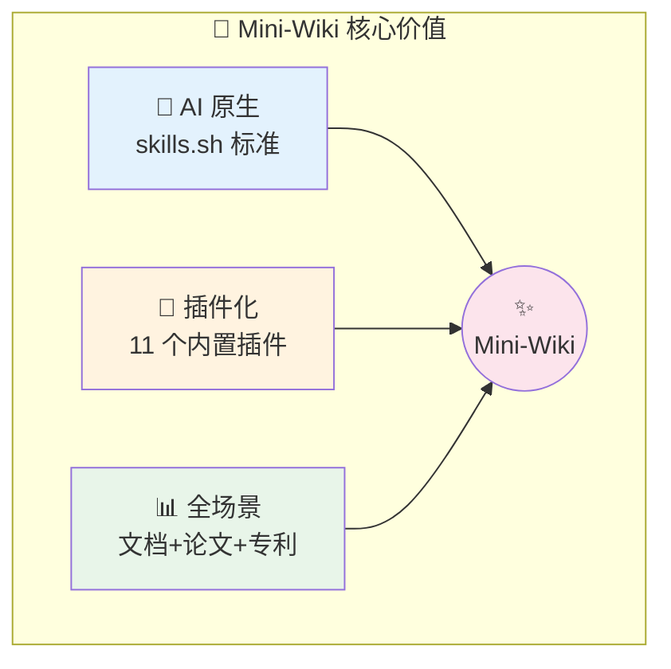
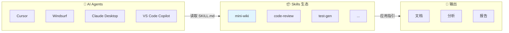
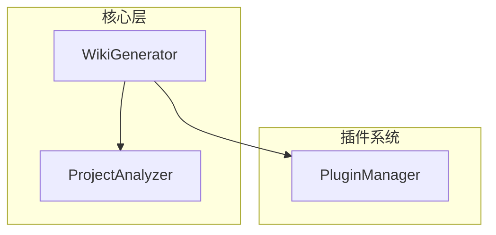
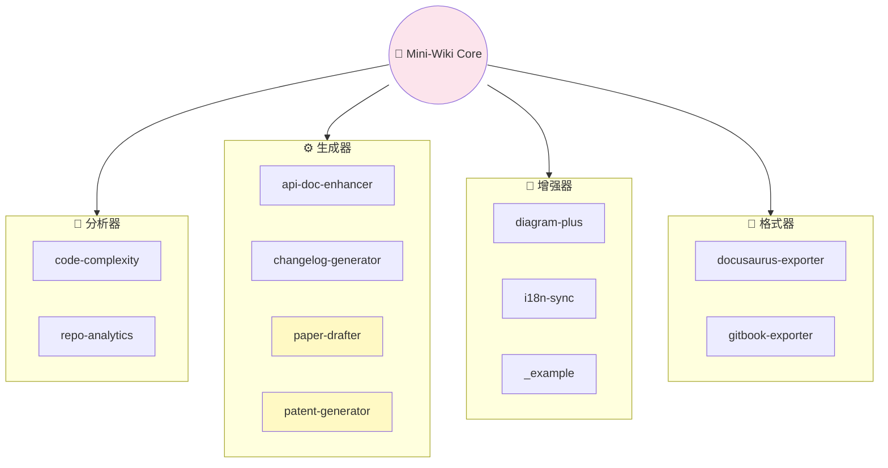
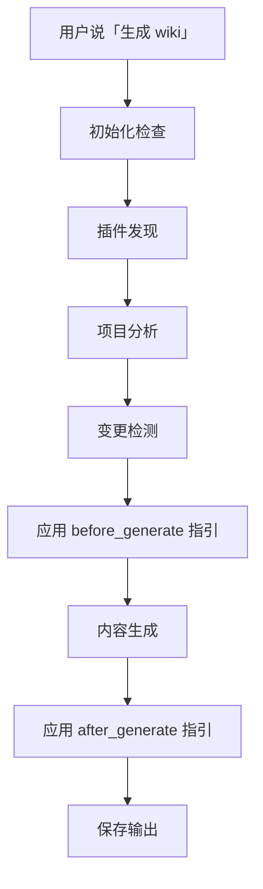

# Mini-Wiki：基于 Skills 架构的新一代 AI 驱动文档生成器

> 当 AI Agent 遇上项目文档，一场关于「自动化」与「智能化」的技术革命正在发生。


[](https://skills.sh)
[](https://github.com/trsoliu/mini-wiki/releases)
[](https://github.com/trsoliu/mini-wiki/blob/main/LICENSE)
[](https://github.com/trsoliu/mini-wiki)

| 项目信息 | |
|----------|---|
| **GitHub** | [https://github.com/trsoliu/mini-wiki](https://github.com/trsoliu/mini-wiki) |
| **作者** | trsoliu |
| **微信** | `trsoliu` |
| **版本** | 3.0.6 |
| **协议** | MIT |

---

## 目录

- [一、引言：文档困境与破局之道](#一引言文档困境与破局之道)
- [二、行业调研：现有方案全景扫描](#二行业调研现有方案全景扫描)
- [三、Skills 架构：理解技术基石](#三skills-架构理解技术基石)
- [四、Mini-Wiki 核心能力详解](#四mini-wiki-核心能力详解)
- [五、系统配置深度解析](#五系统配置深度解析)
- [六、插件系统架构设计](#六插件系统架构设计)
- [七、十一大内置插件完全指南](#七十一大内置插件完全指南)
- [八、插件扩展与自定义开发](#八插件扩展与自定义开发)
- [九、工作流程与最佳实践](#九工作流程与最佳实践)
- [十、综合对比与总结](#十综合对比与总结)

---

## 一、引言：文档困境与破局之道

### 1.1 每个开发者都经历过的痛

如果你是一名开发者，以下场景大概率会让你感同身受：

- **周五下午 5:59**：老板突然说「下周一给投资人演示，把项目文档整理一下」
- **代码重构后**：README 里的架构图还是三个月前的版本
- **新人入职**：「这个函数是干什么的？」「看代码吧，文档没来得及写」
- **开源项目**：Star 数上去了，但 Issue 里全是「文档在哪？怎么用？」

根据 GitHub 年度报告，**超过 60% 的开源项目存在文档缺失或严重过时的问题**。而在企业内部，这个比例更高——毕竟，写文档既不算 KPI，也不会让代码跑得更快。

### 1.2 AI 时代的文档自动化

2023 年以来，随着大语言模型能力的爆发式增长，一个新的思路逐渐清晰：

> **让 AI 来写文档，让人类来审核。**

这不是简单的「用 ChatGPT 生成一段话」，而是一套完整的工程化方案：

1. **自动分析**：AI 理解代码结构、依赖关系、模块职责
2. **智能生成**：根据代码语义生成人类可读的文档
3. **增量更新**：代码变了，文档自动跟着变
4. **多格式输出**：Markdown、Docusaurus、GitBook、LaTeX……

这正是 **Mini-Wiki** 要解决的问题。

### 1.3 为什么是 Mini-Wiki？

市面上已经有不少文档生成工具，但 Mini-Wiki 有三个独特的定位：

| 特性 | 传统工具 | Mini-Wiki |
|------|----------|-----------|
| **架构标准** | 各自为政 | 基于 skills.sh 开放标准 |
| **运行方式** | CLI 命令驱动 | AI Agent 指令驱动 |
| **扩展机制** | 代码插件或无 | 指令型插件系统（5 个 Hooks） |
| **场景覆盖** | 单一功能 | 文档 + 论文 + 专利 + 分析 |

简单来说，Mini-Wiki 是 **第一个为 AI Agent 时代设计的文档生成工具**。



---

## 二、行业调研：现有方案全景扫描

### 2.1 主流方案横向对比


#### DeepWiki（AsyncFuncAI/deepwiki-open）

| 维度 | 评价 |
|------|------|
| **类型** | SaaS 服务 + 开源版本 |
| **优势** | 界面友好、开箱即用、可视化编辑 |
| **局限** | 核心闭源、依赖云服务、无插件机制 |
| **适用** | 快速体验、小型项目演示 |

#### OpenRepoWiki（daeisbae/open-repo-wiki）

| 维度 | 评价 |
|------|------|
| **类型** | 开源工具 |
| **优势** | 完全开源、可自由修改 |
| **局限** | 功能单一、无插件系统、缺乏增量更新 |
| **适用** | 对开源有强需求的团队 |

#### Qoder Repo Wiki

| 维度 | 评价 |
|------|------|
| **类型** | IDE 插件 |
| **优势** | IDE 深度集成、实时预览 |
| **局限** | 绑定特定平台、无法独立运行 |
| **适用** | 特定 IDE 用户 |

#### Mintlify

| 维度 | 评价 |
|------|------|
| **类型** | 商业 SaaS |
| **优势** | 模板精美、托管稳定 |
| **局限** | 付费服务、数据需上传 |
| **适用** | 预算充足的商业团队 |

#### Swagger/OpenAPI 生态

| 维度 | 评价 |
|------|------|
| **类型** | API 文档专用 |
| **优势** | 行业标准、生态成熟 |
| **局限** | 仅限 API 文档、需手动编写 spec |
| **适用** | 纯 API 项目 |

### 2.2 现有方案的共同短板

**问题一：无标准化接口**

每个工具都有自己的配置格式。用户学会一个工具，换一个又要重新学。更关键的是，这些工具无法互通。

**问题二：扩展性差**

大多数工具要么没有插件系统，要么需要用户有开发能力。想加个「生成变更日志」的功能？改源码吧。

**问题三：AI 能力受限**

虽然很多工具号称「AI 驱动」，但实际上只是调用 LLM 做简单的文本生成，缺乏对代码结构的深度分析。

**问题四：与 AI Agent 割裂**

现有工具都是「人操作工具」的模式。但 AI Agent 已经成为开发者标配，我们越来越习惯对 AI 说：「帮我生成这个项目的文档」。现有工具无法响应这种自然语言指令。

### 2.3 Mini-Wiki 的破局思路

Mini-Wiki 的设计哲学：

> **AI 能理解的工具，才是 AI 时代的好工具。**

具体实现：

1. **基于 skills.sh 标准**：让任何兼容的 AI Agent 都能调用
2. **指令型插件**：AI 读取 PLUGIN.md 文本即可应用指引
3. **渐进式披露**：核心指令 150 行，详细参考按需加载
4. **本地优先**：完全离线运行，数据不出本地

---

## 三、Skills 架构：理解技术基石

### 3.1 什么是 Skills.sh？

[skills.sh](https://skills.sh) 是一个开放的 AI Agent 技能规范，定义了如何让 AI Agent「学会」新能力。

你可以把它理解为 **AI 的 npm**：

- npm 让 JavaScript 开发者共享代码包
- skills.sh 让 AI Agent 共享技能包



#### Skills 的核心组成

```
my-skill/
├── SKILL.md          # 核心！AI 的操作手册
├── scripts/          # 辅助脚本（可选）
├── references/       # 详细参考文档（可选）
└── assets/           # 资源文件（可选）
```

`SKILL.md` 是灵魂——它不是给人看的文档，而是 **给 AI 看的指令集**。

### 3.2 Mini-Wiki 的 SKILL.md 设计

```yaml
---
name: mini-wiki
description: |
  Automatically generate structured project Wiki.
  
  Use when:
  - User requests "generate wiki", "create docs"
  - User requests "update wiki", "rebuild wiki"
  - User requests "list plugins", "install plugin"
  
  Features:
  - Smart project structure analysis
  - Incremental updates (only changed files)
  - Auto-generate Mermaid diagrams
  - Code blocks link to source files
  - Multi-language support (zh/en)
  - Plugin system for extensions
---
```

这段 frontmatter 定义了触发词、能力声明、使用场景。

#### 渐进式披露（Progressive Disclosure）

Mini-Wiki 的 SKILL.md 只有约 **150 行**，但能完成复杂任务。秘诀在于分层：

- **Level 1**（SKILL.md）：核心工作流，覆盖 80% 场景
- **Level 2**（references/prompts.md）：详细的 AI 提示词模板
- **Level 3**（references/templates.md）：页面模板
- **Level 4**（plugins/*/PLUGIN.md）：插件扩展指令

### 3.3 Skills 架构的技术优势

| 优势 | 说明 |
|------|------|
| **AI Agent 原生** | AI 直接理解技能的意图、步骤、约束 |
| **跨平台通用** | Cursor、Windsurf、VS Code、Claude Desktop 等通用 |
| **社区生态** | `npx skills add trsoliu/mini-wiki` 一键安装 |
| **可组合性** | 多个 Skills 可协同工作 |

### 3.4 Mini-Wiki 在 skills.sh 生态中的位置

截至 2026 年 1 月，Mini-Wiki 是 skills.sh 生态中：

- **功能最完整的文档生成类 Skill**
- **首个实现完整插件系统的 Skill**
- **内置插件数量最多的 Skill（10 个）**

---

## 四、Mini-Wiki 核心能力详解

### 4.1 智能项目分析

Mini-Wiki 的第一步是「理解」你的项目，这是 **语义级的分析**。

#### 技术栈自动识别

| 检测文件 | 识别结果 |
|----------|----------|
| `package.json` | Node.js / npm 依赖 |
| `requirements.txt` | Python 依赖 |
| `go.mod` | Go 模块 |
| `Cargo.toml` | Rust 项目 |
| `pom.xml` | Java 项目 |
| `tsconfig.json` | TypeScript |

#### 模块结构扫描

```
src/
├── core/           → 核心模块
├── plugins/        → 插件模块
└── utils/          → 工具模块
```

#### 依赖图谱构建

通过分析 `import`/`require` 语句，构建模块间的依赖关系图谱。

#### 实现脚本

```bash
python scripts/analyze_project.py /path/to/project
```

输出结构保存到 `.mini-wiki/cache/structure.json`。

### 4.2 增量更新机制

全量重建既慢又浪费。Mini-Wiki 采用 **基于校验和的增量更新**。

#### 工作原理

1. **首次生成**：计算所有文件的 MD5 校验和
2. **再次生成**：对比当前文件与缓存
3. **差异处理**：新文件→生成、修改→更新、删除→标记过时

#### 性能对比

| 场景 | 全量重建 | 增量更新 |
|------|----------|----------|
| 100 文件改 1 个 | ~60s | ~3s |
| 500 文件改 5 个 | ~5min | ~15s |

### 4.3 架构图自动生成

Mini-Wiki 使用 **Mermaid** 语法自动生成多种架构图：

| 图表类型 | 用途 |
|----------|------|
| `flowchart` | 模块依赖、调用流程 |
| `sequenceDiagram` | API 调用、数据流 |
| `classDiagram` | 类/接口关系 |
| `erDiagram` | 数据模型 |
| `pie` | 统计分布 |

#### 模块依赖图示例



### 4.4 代码链接系统

文档与代码 **双向链接**：

```markdown
### `parseConfig()` [📄](file:///src/config.ts#L42)
```

点击 📄 图标，IDE 直接跳转到源码第 42 行。

### 4.5 多语言支持

```yaml
generation:
  language: both    # zh / en / both
```

目录结构：

```
.mini-wiki/
├── wiki/              # 默认语言
└── i18n/
    ├── en/            # 英文版
    └── zh/            # 中文版
```

### 4.6 输出结构规范

```
.mini-wiki/
├── config.yaml              # 配置文件
├── meta.json                # 元数据
├── cache/                   # 缓存目录
│   ├── checksums.json
│   └── structure.json
├── wiki/                    # 主文档目录
│   ├── index.md
│   ├── architecture.md
│   ├── getting-started.md
│   ├── modules/
│   └── api/
└── i18n/                    # 多语言版本
```

---

## 五、系统配置深度解析

### 5.1 完整配置参考

```yaml
# .mini-wiki/config.yaml

generation:
  language: en          # zh / en / both
  include_diagrams: true
  include_examples: true
  link_to_source: true
  max_file_size: 100000

exclude:
  - node_modules
  - dist
  - "*.test.ts"
  - "**/__tests__/**"

plugins:
  code-complexity:
    thresholds:
      cyclomatic:
        warning: 10
        error: 20
  
  api-doc-enhancer:
    languages:
      - typescript
      - python
    generate_examples: true
  
  changelog-generator:
    repo_url: https://github.com/trsoliu/mini-wiki
    use_emoji: true
```

### 5.2 配置项说明

| 配置项 | 类型 | 默认值 | 说明 |
|--------|------|--------|------|
| `generation.language` | string | `en` | 生成语言 |
| `generation.include_diagrams` | bool | `true` | 包含 Mermaid 图表 |
| `generation.include_examples` | bool | `true` | 生成代码示例 |
| `generation.link_to_source` | bool | `true` | 添加源码链接 |
| `exclude` | array | - | 排除的文件/目录 |

### 5.3 排除规则语法

支持 glob 语法：

| 模式 | 匹配 |
|------|------|
| `node_modules` | 精确匹配目录名 |
| `*.test.ts` | 所有 .test.ts 文件 |
| `**/__tests__/**` | 任意深度的 __tests__ 目录 |

---

## 六、插件系统架构设计

插件系统是 Mini-Wiki 最强大的特性。它采用独特的 **指令型架构**，让扩展变得简单而强大。

### 6.1 传统插件 vs 指令型插件

| 维度 | 传统代码插件 | Mini-Wiki 指令型插件 |
|------|--------------|----------------------|
| **加载方式** | 运行时动态加载代码 | AI 读取 PLUGIN.md 文本 |
| **运行环境** | 需要特定运行时 | 无需运行环境 |
| **安全性** | 可能运行恶意代码 | 纯文本，安全可控 |
| **开发门槛** | 需要编程能力 | 只需写 Markdown |
| **调试难度** | 需要调试器 | 直接阅读文本 |

**核心洞察**：

- 传统插件：**人写代码 → 机器运行代码**
- 指令型插件：**人写指令 → AI 理解指令 → AI 应用指引**

### 6.2 插件生命周期 Hooks

Mini-Wiki 定义了 **5 个标准 Hook**：


| Hook | 触发时机 | 典型用途 |
|------|----------|----------|
| `on_init` | 初始化时 | 检查依赖、初始化资源 |
| `after_analyze` | 分析后 | 添加额外分析数据、计算指标 |
| `before_generate` | 生成前 | 修改模板、注入提示词 |
| `after_generate` | 生成后 | 后处理文档、添加交叉引用 |
| `on_export` | 导出时 | 格式转换（Docusaurus/GitBook） |

### 6.3 插件类型分类

| 类型 | 英文 | 职责 | 示例插件 |
|------|------|------|----------|
| 分析器 | `analyzer` | 增强项目分析 | code-complexity, repo-analytics |
| 生成器 | `generator` | 生成新类型文档 | api-doc-enhancer, paper-drafter |
| 增强器 | `enhancer` | 增强现有功能 | diagram-plus, i18n-sync |
| 格式器 | `formatter` | 输出格式转换 | docusaurus-exporter, gitbook-exporter |
| 集成器 | `integrator` | 外部系统集成 | - |

### 6.4 _registry.yaml 注册表

所有插件注册在 `plugins/_registry.yaml`：

```yaml
plugins:
  - name: code-complexity
    type: analyzer
    builtin: true
    enabled: true
    priority: 10
  
  - name: api-doc-enhancer
    type: generator
    builtin: true
    enabled: true
    priority: 20
  
  - name: my-custom-plugin
    type: enhancer
    builtin: false
    enabled: true
    priority: 50
    source: https://github.com/user/my-plugin
```

| 字段 | 说明 |
|------|------|
| `name` | 插件唯一标识 |
| `type` | 插件类型 |
| `builtin` | 是否内置 |
| `enabled` | 是否启用 |
| `priority` | 应用优先级（小数字先应用） |
| `source` | 安装来源（第三方插件） |

### 6.5 插件指引协议

AI 如何知道要应用插件指引？答案在 `SKILL.md` 的「Plugin Instruction Protocol」：

```markdown
## 🔌 Plugin Instruction Protocol (No Code Execution)

**CRITICAL**: As an AI using this skill, you **MUST**:

1. **Load Registry**: Read `plugins/_registry.yaml`
2. **Read Manifests**: For each enabled plugin, read its `PLUGIN.md`
3. **Apply Hook Instructions (text-only)**: At each lifecycle stage, apply matching instructions
```

这就是「指令型插件」的实现机制：**AI 作为指引应用者，PLUGIN.md 作为指令集**。

### 6.6 插件安装来源

```bash
# GitHub 仓库
python scripts/plugin_manager.py install owner/repo

# URL 下载
python scripts/plugin_manager.py install https://example.com/plugin.zip

# 本地目录
python scripts/plugin_manager.py install ./my-local-plugin
```

---

## 七、十一大内置插件完全指南

Mini-Wiki 3.0.6 内置了 **11 个开箱即用的插件**，覆盖分析、生成、增强、格式化四大类别。



### 7.1 分析类插件（Analyzers）

---

#### 🔬 code-complexity：代码复杂度分析器

**定位**：自动计算代码健康度，识别需要重构的「坏味道」。

**核心指标**：

| 指标 | 说明 | 健康阈值 |
|------|------|----------|
| 圈复杂度 | 代码分支路径数 | ≤10 🟢 / ≤20 🟡 / >20 🔴 |
| 认知复杂度 | 人类理解难度 | ≤15 🟢 / ≤25 🟡 / >25 🔴 |
| 嵌套深度 | 最大嵌套层级 | ≤4 🟢 / ≤6 🟡 / >6 🔴 |
| 代码行数 | 函数平均行数 | ≤50 🟢 / ≤100 🟡 / >100 🔴 |

**健康评分**：

| 评分 | 状态 | 建议 |
|------|------|------|
| 90-100 | 🟢 优秀 | 保持现状 |
| 70-89 | 🟡 良好 | 可选优化 |
| 50-69 | 🟠 一般 | 建议重构 |
| 0-49 | 🔴 较差 | 必须重构 |

**热点识别**：
- 🔥 高复杂度函数（>20）
- ⚠️ 深层嵌套（>6 层）
- 📦 过大模块（>500 行）
- 🔄 高耦合（>10 依赖）

**支持语言**：TypeScript, Python, Go, Java, Rust

**完整输出示例**：

```markdown
# 📊 代码健康度报告

> 扫描时间：2026-01-28 14:30:00
> 扫描文件：127 个
> 扫描函数：340 个

## 概览仪表盘

| 指标 | 当前值 | 趋势 | 状态 |
|------|--------|------|------|
| 平均圈复杂度 | 5.2 | ↓ 0.3 | 🟢 优秀 |
| 最高圈复杂度 | 23 | ↑ 2 | 🔴 需关注 |
| 平均嵌套深度 | 2.1 | → | 🟢 优秀 |
| 代码健康评分 | **78/100** | ↑ 3 | 🟡 良好 |

## 🔥 热点函数 Top 10

| 排名 | 函数 | 文件 | 圈复杂度 | 认知复杂度 | 行数 | 建议 |
|------|------|------|----------|------------|------|------|
| 1 | `parseConfig` | [config.ts:42](file:///src/config.ts#L42) | 23 | 28 | 156 | 拆分为多个子函数 |
| 2 | `validateInput` | [validator.ts:15](file:///src/validator.ts#L15) | 18 | 22 | 89 | 简化条件判断 |
| 3 | `processData` | [handler.ts:89](file:///src/handler.ts#L89) | 15 | 18 | 67 | 提取业务逻辑 |
| 4 | `renderTemplate` | [render.ts:23](file:///src/render.ts#L23) | 14 | 16 | 78 | 使用策略模式 |
| 5 | `handleRequest` | [api.ts:156](file:///src/api.ts#L156) | 12 | 14 | 54 | 拆分路由处理 |

## 模块复杂度分布

​```mermaid
pie title 模块复杂度占比
    "core (35%)" : 35
    "plugins (25%)" : 25
    "api (20%)" : 20
    "utils (10%)" : 10
    "其他 (10%)" : 10
​```

## 复杂度趋势（近 6 个月）

​```mermaid
xychart-beta
    title "圈复杂度变化趋势"
    x-axis ["8月", "9月", "10月", "11月", "12月", "1月"]
    y-axis "平均复杂度" 0 --> 10
    line [7.2, 6.8, 6.5, 5.9, 5.5, 5.2]
​```

## 重构建议优先级

| 优先级 | 文件 | 问题 | 预计收益 |
|--------|------|------|----------|
| P0 | `src/config.ts` | 圈复杂度 23，超标 | 降低维护成本 50% |
| P1 | `src/validator.ts` | 嵌套过深（7层） | 提升可读性 |
| P2 | `src/handler.ts` | 函数过长（156行） | 便于单元测试 |
```

**CI/CD 集成示例**：

```yaml
# .github/workflows/code-quality.yml
- name: Check Code Complexity
  run: |
    python scripts/complexity_analyzer.py check \
      --fail-on-error \
      --threshold-cyclomatic 20 \
      --threshold-nesting 6
```

---

#### 📊 repo-analytics：仓库统计分析器

**定位**：深度挖掘 Git 历史，生成贡献者画像和代码演进报告。

**核心能力**：

| 功能 | 说明 |
|------|------|
| 贡献者画像 | 提交数、代码行数、活跃时段 |
| 代码演进 | 每周增删量趋势图 |
| 文件热度 | 修改频率排行（技术债务预警） |
| 关联分析 | 经常一起修改的文件对 |

**完整输出示例**：

```markdown
# 📊 仓库统计报告

> 统计周期：2025-01-28 ~ 2026-01-28（365 天）
> 总提交数：1,234
> 活跃贡献者：15 人

## 👥 贡献者排行榜

| 排名 | 作者 | 提交数 | 新增行 | 删除行 | 净增 | 活跃度 |
|------|------|--------|--------|--------|------|--------|
| 🥇 | Alice | 456 | +25,680 | -8,920 | +16,760 | 🔥🔥🔥🔥🔥 |
| 🥈 | Bob | 312 | +18,450 | -6,230 | +12,220 | 🔥🔥🔥🔥 |
| 🥉 | Charlie | 198 | +12,100 | -4,560 | +7,540 | 🔥🔥🔥 |
| 4 | David | 145 | +8,900 | -3,200 | +5,700 | 🔥🔥 |
| 5 | Eve | 89 | +5,600 | -2,100 | +3,500 | 🔥 |

## 📈 代码频率趋势

​```mermaid
xychart-beta
    title "月度代码变更量"
    x-axis ["2月", "3月", "4月", "5月", "6月", "7月", "8月", "9月", "10月", "11月", "12月", "1月"]
    y-axis "代码行数" -5000 --> 15000
    bar [+8500, +6200, +12000, +4500, +9800, +7200, +11000, +5600, +8900, +10200, +6800, +9500]
    bar [-2100, -1800, -3500, -1200, -2800, -2000, -3200, -1500, -2600, -2900, -1900, -2700]
​```

## 🔥 热点文件 Top 10

| 排名 | 文件 | 修改次数 | 最近修改 | 主要贡献者 | 风险评估 |
|------|------|----------|----------|------------|----------|
| 1 | `src/core/engine.ts` | 89 | 2天前 | Alice (45%) | ⚠️ 高风险 |
| 2 | `src/api/handler.ts` | 67 | 3天前 | Bob (38%) | ⚠️ 中风险 |
| 3 | `README.md` | 54 | 1天前 | Charlie (52%) | 🟢 低风险 |
| 4 | `src/plugins/loader.ts` | 48 | 5天前 | Alice (60%) | ⚠️ 中风险 |
| 5 | `package.json` | 42 | 1周前 | David (35%) | 🟢 低风险 |

## 🔗 文件关联分析

经常一起修改的文件对（可能存在耦合）：

| 文件 A | 文件 B | 共同修改次数 | 关联强度 |
|--------|--------|--------------|----------|
| `engine.ts` | `parser.ts` | 34 | 🔴 强耦合 |
| `handler.ts` | `validator.ts` | 28 | 🟡 中等耦合 |
| `loader.ts` | `registry.ts` | 22 | 🟡 中等耦合 |

## 📅 提交时间分布

​```mermaid
xychart-beta
    title "每周提交分布"
    x-axis ["周一", "周二", "周三", "周四", "周五", "周六", "周日"]
    y-axis "提交数" 0 --> 300
    bar [245, 268, 289, 256, 198, 45, 33]
​```

## 🏷️ 版本里程碑

| 版本 | 发布日期 | 提交数 | 主要变更 |
|------|----------|--------|----------|
| v2.1.0 | 2026-01-28 | 156 | 新增 3 个插件 |
| v2.0.0 | 2026-01-26 | 423 | 插件系统重构 |
| v1.0.0 | 2026-01-26 | 655 | 初始版本 |
```

---

### 7.2 生成类插件（Generators）

---

#### 📖 api-doc-enhancer：API 文档增强器

**定位**：自动从代码注释和类型定义中提取 API 文档。

**注释格式支持**：

| 语言 | 格式 |
|------|------|
| TypeScript/JS | JSDoc (`/** ... */`) |
| Python | Docstring (`"""..."""`) |
| Go | GoDoc comments |
| Rust | `///` 文档注释 |
| Java | Javadoc |

**输出示例**：

```markdown
## `createUser(name, age?)`

创建新用户。

**参数**

| 参数 | 类型 | 必填 | 说明 |
|------|------|------|------|
| `name` | `string` | ✅ | 用户名称 |
| `age` | `number` | ❌ | 年龄，默认 18 |

**返回值**：`Promise<User>`

[📄 查看源码](file:///src/user.ts#L42)
```

---

#### 📝 changelog-generator：变更日志生成器

**定位**：从 Git 提交历史自动生成格式化的 CHANGELOG。

**Conventional Commits 支持**：

| 类型 | 显示 | 图标 |
|------|------|------|
| `feat` | 新功能 | ✨ |
| `fix` | Bug 修复 | 🐛 |
| `docs` | 文档 | 📝 |
| `refactor` | 重构 | ♻️ |
| `perf` | 性能 | ⚡ |

**特色功能**：
- 基于 Git 标签自动版本分组
- Breaking Changes 高亮（⚠️）
- 自动链接 GitHub Issue/PR

---

#### 📄 paper-drafter：学术论文起草助手 ⭐

**定位**：将项目转化为符合学术规范的论文草稿。

> **独家功能**：目前没有任何同类工具提供此能力。

**IMRaD 结构**：

| 章节 | 内容来源 |
|------|----------|
| Introduction | README 问题描述 → Research Gap |
| Methodology | 架构文档 → System Design |
| Results | 测试数据 → Experimental Results |
| Discussion | 限制与未来工作 |

**特色功能**：
- LaTeX 深度集成（IEEEtran/ACM 模板）
- 自动生成 BibTeX 引用占位符
- 学术语言优化（leverage, propose, demonstrate）
- 伪代码自动生成（Algorithm 环境）

**输出文件**：
- `paper/draft.tex` - LaTeX 源文件
- `paper/draft.md` - Markdown 预览
- `paper/references.bib` - 参考文献

**LaTeX 输出示例**：

```latex
\documentclass[conference]{IEEEtran}
\usepackage{algorithm}
\usepackage{algpseudocode}

\title{Mini-Wiki: An Agent-Driven Framework for Automated 
       Project Documentation Generation}

\author{
  \IEEEauthorblockN{Author Name}
  \IEEEauthorblockA{Institution\\
  email@example.com}
}

\begin{abstract}
Maintaining up-to-date documentation remains a significant 
challenge in software development. This paper presents 
Mini-Wiki, a novel framework that leverages Large Language 
Models (LLMs) to automatically generate and maintain 
comprehensive project documentation. Our approach introduces 
an instruction-based plugin architecture that enables 
extensible documentation generation without runtime code 
execution. Experimental evaluation demonstrates that 
Mini-Wiki reduces documentation effort by 73\% while 
maintaining quality scores comparable to human-written 
documentation.
\end{abstract}

\begin{IEEEkeywords}
documentation generation, LLM, agent skills, plugin system
\end{IEEEkeywords}

\section{Introduction}
Software documentation is essential for knowledge transfer 
and system maintenance~\cite{parnas2011}. However, studies 
show that over 60\% of open-source projects suffer from 
outdated or missing documentation...

\section{Methodology}
\subsection{System Architecture}
The proposed system employs a hook-based lifecycle 
management approach...

\begin{algorithm}
\caption{Plugin Execution Protocol}
\begin{algorithmic}[1]
\State Load registry from \texttt{\_registry.yaml}
\For{each enabled plugin $p$}
    \State Read $p$'s \texttt{PLUGIN.md}
    \State Extract hooks $H_p$
\EndFor
\For{each lifecycle stage $s$}
    \For{each hook $h \in H$ where $h.stage = s$}
        \State Execute $h.instructions$
    \EndFor
\EndFor
\end{algorithmic}
\end{algorithm}

\section{Experimental Results}
...

\bibliographystyle{IEEEtran}
\bibliography{references}
\end{document}
```

**使用场景**：
- 开源项目申请学术会议 Demo Paper
- 技术方案转化为可发表论文
- 毕业设计/课程项目文档

---

#### 📜 patent-generator：专利技术交底书生成器 ⭐⭐

**定位**：基于资深专利代理人经验，从项目实施案例自动生成符合专利规范的技术交底书。

> **v3.0.0 全新重写**：参照《专利法实施细则》和《专利审查指南》，采用 7 步标准专利撰写流程。

**核心撰写原则**：

| 原则 | 说明 |
|------|------|
| 极端通用性 | 技术方案描述必须具备最大适用范围 |
| 术语抽象化 | Redis → "高速缓存存储介质"，MySQL → "关系型数据库" |
| 禁用词汇检查 | 避免"本发明"、"最佳"、"优选"等表述 |
| IPC 分类对齐 | 技术领域符合国际专利分类标准 |

**7 步标准流程**：
1. 发明名称（通用性、抽象性）
2. 所属技术领域（IPC 分类）
3. 背景技术及其缺陷
4. 发明目的
5. 技术方案（详尽步骤）
6. 有益效果
7. 实施案例（多个具象化实施例）

**输出文件**：
- `patent/disclosure.md` - 完整技术交底书
- `patent/elements/` - 各专利要素独立文件

**技术交底书输出示例**：

```markdown
# 技术交底书

## 一、发明名称

一种基于指令型插件架构的自动化项目文档生成方法及系统

## 二、所属技术领域

本发明涉及软件工程领域，特别涉及一种基于人工智能代理的自动化文档生成技术。

## 三、背景技术及其缺陷

现有技术中，项目文档的生成主要依赖以下方式：
1. 人工撰写：效率低下，难以保持与代码同步
2. 传统文档生成工具：仅提取注释，缺乏语义理解
3. 基于模板的生成器：灵活性差，无法适应不同项目结构

上述方案存在以下缺陷：
- 文档更新滞后于代码变更
- 缺乏对代码结构的深度分析能力
- 扩展机制需要编程能力，门槛较高

## 四、发明目的

本发明旨在提供一种自动化程度高、可扩展性强的项目文档生成方法及系统。

## 五、技术方案

本发明采用以下技术手段实现上述目的：
1. 构建指令型插件架构，通过文本指令而非可执行代码实现功能扩展
2. 采用基于校验和的增量更新机制，仅处理变更文件
3. 利用大语言模型对代码进行语义分析，生成结构化文档

## 六、有益效果

1. 文档生成效率提升：增量更新速度比全量重建提升 20 倍
2. 扩展安全性增强：纯文本插件消除代码注入风险
3. 降低使用门槛：无需编程即可开发插件
```

**使用场景**：
- 企业技术成果专利化
- 开源项目知识产权保护
- 技术方案的防御性公开

---

### 7.3 增强类插件（Enhancers）

---

#### 📈 diagram-plus：图表增强器

**定位**：扩展 Mermaid 图表生成能力。

**支持图表类型**：

| 类型 | 用途 | 自动生成 |
|------|------|----------|
| flowchart | 流程图 | ✅ |
| sequenceDiagram | 时序图 | ✅ |
| classDiagram | 类图 | ✅ |
| erDiagram | ER 图 | ✅ |
| mindmap | 思维导图 | ✅ |
| pie | 饼图 | ⚙️ |
| gitGraph | Git 图 | ✅ |

**智能布局**：
- 自动选择最佳方向（TB/LR）
- 模块分组（subgraph）
- 节点颜色编码

---

#### 🌐 i18n-sync：多语言同步工具

**定位**：自动检测多语言文档差异，辅助翻译同步。

**差异检测**：

| 状态 | 图标 | 说明 |
|------|------|------|
| 同步 | 🟢 | 内容一致 |
| 过时 | 🟡 | 原文已更新 |
| 缺失 | 🔴 | 翻译不存在 |
| 多余 | ⚪ | 原文已删除 |

**特色功能**：
- 翻译记忆（保存已翻译片段）
- 可选 AI 翻译集成（OpenAI/DeepL）
- 同步状态报告 + 进度追踪

---

### 7.4 格式化插件（Formatters）

---

#### 🦖 docusaurus-exporter：Docusaurus 导出器

**定位**：将 Wiki 导出为 Docusaurus 兼容格式。

**转换能力**：

| 功能 | 说明 |
|------|------|
| 结构转换 | `.mini-wiki/wiki/` → `docs/` |
| Frontmatter | 自动生成 id, title, sidebar_position |
| 侧边栏 | 自动生成 `sidebars.js` |
| i18n 映射 | 转换为 Docusaurus i18n 结构 |

---

#### 📚 gitbook-exporter：GitBook 导出器

**定位**：将 Wiki 导出为 GitBook 兼容格式。

**转换能力**：

| 功能 | 说明 |
|------|------|
| SUMMARY.md | 自动生成导航目录 |
| book.json | 自动生成配置文件 |
| 多语言 | LANGS.md + 语言子目录 |

**Docusaurus vs GitBook 对比**：

| 特性 | GitBook | Docusaurus |
|------|---------|------------|
| 导航配置 | SUMMARY.md | sidebars.js |
| 配置文件 | book.json | docusaurus.config.js |
| 适合场景 | 快速文档 | 完整文档站 |

---

### 7.5 示例与模板插件

---

#### 📦 _example：插件开发模板

**定位**：作为插件开发的起点模板，展示标准插件格式。

**为什么重要**：

这不是一个「功能插件」，而是一个「教学插件」。它的价值在于：

1. **标准示范**：展示 PLUGIN.md 的正确写法
2. **快速起步**：复制即可开始开发自己的插件
3. **Hook 示例**：演示 `after_analyze` 和 `before_generate` 的用法

**目录结构**：

```
_example/
└── PLUGIN.md         # 插件指令文件
```

**PLUGIN.md 示例**：

```yaml
---
name: example-enhancer
type: enhancer
version: 1.0.0
description: Example plugin demonstrating the plugin format
author: trsoliu
requires:
  - mini-wiki >= 2.0.0
hooks:
  - after_analyze
  - before_generate
---

# Example Enhancer

This is an example plugin demonstrating the plugin format.

## Hooks

### after_analyze
After project analysis, this hook can add additional analysis data.

### before_generate
Before content generation, this hook can modify prompts or templates.
```

**使用方式**：

```bash
# 1. 复制模板
cp -r plugins/_example plugins/my-plugin

# 2. 修改 PLUGIN.md
# 3. 注册到 _registry.yaml
# 4. 启用插件
python scripts/plugin_manager.py enable my-plugin
```

---

### 7.6 插件完整清单速览

| 序号 | 插件名 | 类型 | 核心功能 | 优先级 |
|------|--------|------|----------|--------|
| 1 | `code-complexity` | analyzer | 代码复杂度分析、健康评分 | 10 |
| 2 | `repo-analytics` | analyzer | Git 统计、贡献者分析 | 12 |
| 3 | `paper-drafter` | generator | 学术论文草稿生成 | 13 |
| 4 | `patent-generator` | generator | 专利文档生成 | 15 |
| 5 | `api-doc-enhancer` | generator | API 文档增强 | 20 |
| 6 | `changelog-generator` | generator | 变更日志生成 | 25 |
| 7 | `diagram-plus` | enhancer | Mermaid 图表增强 | 30 |
| 8 | `i18n-sync` | enhancer | 多语言同步 | 35 |
| 9 | `docusaurus-exporter` | formatter | 导出 Docusaurus | 40 |
| 10 | `gitbook-exporter` | formatter | 导出 GitBook | 45 |
| 11 | `_example` | enhancer | 插件开发模板 | - |

---

### 7.7 插件配置完整示例

以下是一个包含所有插件配置的完整 `config.yaml` 示例：

```yaml
# .mini-wiki/config.yaml

generation:
  language: both
  include_diagrams: true
  include_examples: true
  link_to_source: true

exclude:
  - node_modules
  - dist
  - "*.test.ts"

# ========== 插件配置 ==========

plugins:
  # ---------- 分析类插件 ----------
  
  code-complexity:
    metrics:
      - cyclomatic
      - cognitive
      - loc
      - nesting
      - params
    thresholds:
      cyclomatic:
        warning: 10
        error: 20
      cognitive:
        warning: 15
        error: 25
      nesting:
        warning: 4
        error: 6
    exclude:
      - "**/*.test.ts"
      - "**/__tests__/**"
    track_trends: true
    show_badge: true
  
  repo-analytics:
    days: 365
    exclude_authors:
      - "dependabot[bot]"
      - "github-actions[bot]"
    exclude_paths:
      - "yarn.lock"
      - "package-lock.json"
    charts:
      heatmap: true
      contributors: true
      churn: true
  
  # ---------- 生成类插件 ----------
  
  api-doc-enhancer:
    languages:
      - typescript
      - python
      - go
    generate_examples: true
    include_private: false
    diagram_style: mermaid
  
  changelog-generator:
    repo_type: github
    repo_url: https://github.com/trsoliu/mini-wiki
    format:
      show_authors: true
      show_dates: true
      show_commits: true
      use_emoji: true
      group_by_scope: false
    include_types:
      - feat
      - fix
      - docs
      - perf
      - refactor
    exclude_types:
      - chore
      - style
      - test
    unreleased_title: "🚧 开发中"
  
  paper-drafter:
    template: IEEE          # IEEE | ACM | Nature_Style | Generic
    language: en
    focus: system           # system | algorithm | application
    include_pseudocode: true
  
  patent-generator:
    jurisdiction: CN        # CN | US | EP | PCT
    strategy: defensive     # defensive | offensive
    enable_triz_analysis: true
    embodiment_expansion_level: high
    term_abstraction:
      "Redis": "high-speed caching memory"
      "MySQL": "relational database storage"
      "React Component": "user interface rendering unit"
  
  # ---------- 增强类插件 ----------
  
  diagram-plus:
    diagrams:
      - class
      - flowchart
      - sequence
      - er
      - mindmap
    default_direction: TB
    theme: default
    max_nodes: 50
    show_private: false
    interactive: false
  
  i18n-sync:
    source_language: en
    target_languages:
      - zh
      - ja
    ignore:
      - "**/*.draft.md"
    generate_report: true
    translation_memory:
      enabled: true
      file: cache/i18n-memory.yaml
    ai_translation:
      enabled: false
      provider: openai
      auto_translate: false
    notifications:
      outdated_threshold_days: 7
  
  # ---------- 格式化插件 ----------
  
  docusaurus-exporter:
    output_dir: ./docusaurus-docs
    docusaurus_version: 3
    versioning: false
    default_locale: en
    locales:
      - en
      - zh
    sidebar_position_from: filename
  
  gitbook-exporter:
    output_dir: ./gitbook-docs
    gitbook_version: "3.2.3"
    default_language: zh-hans
    multilingual: true
    languages:
      - code: en
        label: English
      - code: zh
        label: 中文
    plugins:
      - search
      - sharing
      - highlight
      - copy-code-button
    pdf_options:
      enabled: true
      fontSize: 12
      paperSize: a4
```

---

### 7.8 插件命令速查表

| 插件 | 命令/指令 | 说明 |
|------|-----------|------|
| **code-complexity** | `python scripts/complexity_analyzer.py analyze` | 运行复杂度分析 |
| | `python scripts/complexity_analyzer.py check --fail-on-error` | CI 检查 |
| **repo-analytics** | `python scripts/plugin_manager.py run repo-analytics report` | 生成统计报告 |
| **changelog-generator** | `python scripts/changelog_generator.py generate` | 生成完整日志 |
| | `python scripts/changelog_generator.py generate --unreleased` | 仅未发布变更 |
| | `python scripts/changelog_generator.py lint` | 验证提交格式 |
| **paper-drafter** | `python scripts/plugin_manager.py run paper-drafter generate` | 生成论文草稿 |
| | `python scripts/plugin_manager.py run paper-drafter outline` | 仅生成大纲 |
| **patent-generator** | `python scripts/plugin_manager.py run patent-generator generate --full` | 生成全套文件 |
| | `python scripts/plugin_manager.py run patent-generator claims` | 仅权利要求 |
| | `python scripts/plugin_manager.py run patent-generator fto-check` | 侵权规避分析 |
| **diagram-plus** | `python scripts/diagram_generator.py regenerate` | 重新生成图表 |
| | `python scripts/diagram_generator.py --type class` | 指定类型 |
| **i18n-sync** | `python scripts/i18n_sync.py status` | 检查同步状态 |
| | `python scripts/i18n_sync.py export --lang zh` | 导出待翻译 |
| | `python scripts/i18n_sync.py translate --lang zh` | AI 辅助翻译 |
| **docusaurus-exporter** | `"export wiki to docusaurus"` | 自然语言指令 |
| **gitbook-exporter** | `"export wiki to gitbook"` | 自然语言指令 |

---

## 八、插件扩展与自定义开发

### 8.1 安装第三方插件

```bash
# 从 GitHub 安装
python scripts/plugin_manager.py install owner/repo

# 从 URL 安装
python scripts/plugin_manager.py install https://example.com/plugin.zip

# 从本地安装
python scripts/plugin_manager.py install ./my-plugin
```

### 8.2 插件管理命令

```bash
# 列出所有插件
python scripts/plugin_manager.py list

# 启用/禁用插件
python scripts/plugin_manager.py enable <name>
python scripts/plugin_manager.py disable <name>

# 更新插件
python scripts/plugin_manager.py update <name>

# 卸载插件
python scripts/plugin_manager.py uninstall <name>
```

### 8.3 自定义插件开发

#### PLUGIN.md 模板

```yaml
---
name: my-plugin
type: generator          # analyzer | generator | formatter | enhancer
version: 1.0.0
description: 插件描述
author: Your Name
requires:
  - mini-wiki >= 2.0.0
hooks:
  - after_analyze
  - after_generate
---

# 插件名称

插件描述。

## Hooks

### after_analyze

分析后进行的操作：
1. 读取 cache/structure.json
2. 进行自定义分析
3. 保存结果到 cache/my-data.json

### after_generate

生成后处理的操作：
1. 读取生成的文档
2. 添加自定义内容
3. 更新文档
```

#### 目录结构

```
my-plugin/
├── PLUGIN.md         # 必需：插件指令
├── scripts/          # 可选：辅助脚本
├── references/       # 可选：参考文档
└── assets/           # 可选：资源文件
```

### 8.4 Skills 生态互通

任何 skills.sh 兼容的 Skill 都可以安装为 Mini-Wiki 插件：

```bash
npx skills add some-skill
python scripts/plugin_manager.py install ./skills/some-skill
```

Mini-Wiki 会自动将通用 Skill 包装为插件格式。

---

## 九、工作流程与最佳实践

### 9.1 完整工作流程



### 9.2 推荐工作流

**日常开发**：
```
1. 编写代码
2. 提交 commit（使用 Conventional Commits）
3. 对 AI 说「update wiki」
4. Review 生成的文档
```

**版本发布**：
```
1. 打 Git 标签
2. 对 AI 说「generate changelog」
3. 对 AI 说「export wiki to docusaurus」
4. 部署文档站
```

### 9.3 CI/CD 集成

```yaml
# .github/workflows/docs.yml
name: Generate Docs

on:
  push:
    branches: [main]

jobs:
  docs:
    runs-on: ubuntu-latest
    steps:
      - uses: actions/checkout@v4
      
      - name: Setup Python
        uses: actions/setup-python@v4
        with:
          python-version: '3.11'
      
      - name: Generate Wiki
        run: |
          # 使用 AI Agent 或脚本生成
          python scripts/analyze_project.py .
          python scripts/detect_changes.py .
      
      - name: Check i18n status
        run: |
          python scripts/i18n_sync.py status --strict
```

---

## 十、综合对比与总结

### 10.1 与竞品全面对比

| 维度 | Mini-Wiki | DeepWiki | OpenRepoWiki | Mintlify |
|------|-----------|----------|--------------|----------|
| **架构标准** | skills.sh ✅ | 私有 | 无 | 私有 |
| **插件系统** | 5 Hooks ✅ | ❌ | ❌ | 有限 |
| **内置插件** | 11 个 ✅ | ❌ | ❌ | 3-5 |
| **离线运行** | ✅ | ❌ | ✅ | ❌ |
| **增量更新** | ✅ | ❌ | ❌ | ✅ |
| **专利生成** | ✅ | ❌ | ❌ | ❌ |
| **论文生成** | ✅ | ❌ | ❌ | ❌ |
| **多语言** | ✅ | 部分 | ❌ | ✅ |
| **开源** | ✅ | 部分 | ✅ | ❌ |
| **价格** | 免费 | 部分付费 | 免费 | 付费 |

### 10.2 适用场景

| 场景 | 推荐度 | 说明 |
|------|--------|------|
| 开源项目文档 | ⭐⭐⭐⭐⭐ | 完美契合 |
| 企业内部知识库 | ⭐⭐⭐⭐⭐ | 本地部署，数据安全 |
| 学术项目 | ⭐⭐⭐⭐⭐ | 论文/专利辅助 |
| 技术债务可视化 | ⭐⭐⭐⭐ | 复杂度分析 |
| API 文档 | ⭐⭐⭐⭐ | 配合 api-doc-enhancer |
| 多语言项目 | ⭐⭐⭐⭐ | i18n-sync 支持 |

### 10.3 Mini-Wiki 的核心价值

1. **Skills 架构**：AI 原生，跨平台通用
2. **指令型插件**：安全、易开发、易理解
3. **开箱即用**：11 个内置插件覆盖主流场景
4. **场景独特**：论文/专利生成，独家功能

### 10.4 未来展望

- **插件市场**：更多第三方插件
- **可视化编辑器**：GUI 配置界面
- **更多语言支持**：Swift, Kotlin, PHP 等
- **AI 模型优化**：更精准的代码理解

---

## 附录

### A. 快速安装

```bash
# 方式一：npx（推荐）
npx skills add trsoliu/mini-wiki

# 方式二：克隆仓库
git clone https://github.com/trsoliu/mini-wiki.git
```

### B. 常用命令速查

| 命令 | 说明 |
|------|------|
| `"generate wiki"` | 生成 Wiki |
| `"update wiki"` | 更新 Wiki |
| `"list plugins"` | 列出插件 |
| `"install plugin <source>"` | 安装插件 |
| `"export wiki to docusaurus"` | 导出为 Docusaurus |

### C. 脚本参考

| 脚本 | 用途 |
|------|------|
| `init_wiki.py` | 初始化 .mini-wiki 目录 |
| `analyze_project.py` | 分析项目结构 |
| `detect_changes.py` | 检测文件变更 |
| `generate_diagram.py` | 生成 Mermaid 图表 |
| `extract_docs.py` | 提取代码注释 |
| `generate_toc.py` | 生成目录 |
| `plugin_manager.py` | 插件管理 |

### D. 相关资源

- **GitHub**: [https://github.com/trsoliu/mini-wiki](https://github.com/trsoliu/mini-wiki)
- **Skills.sh**: [https://skills.sh](https://skills.sh)
- **灵感来源**: DeepWiki, OpenRepoWiki, Qoder

---

**作者**：trsoliu  
**项目地址**：[https://github.com/trsoliu/mini-wiki](https://github.com/trsoliu/mini-wiki)  
**微信**：`trsoliu`

如果觉得有帮助，请给个 ⭐ Star！
