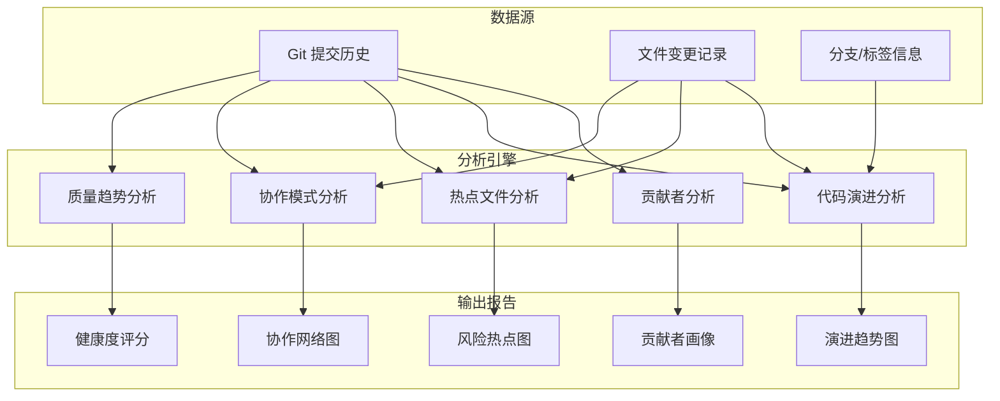
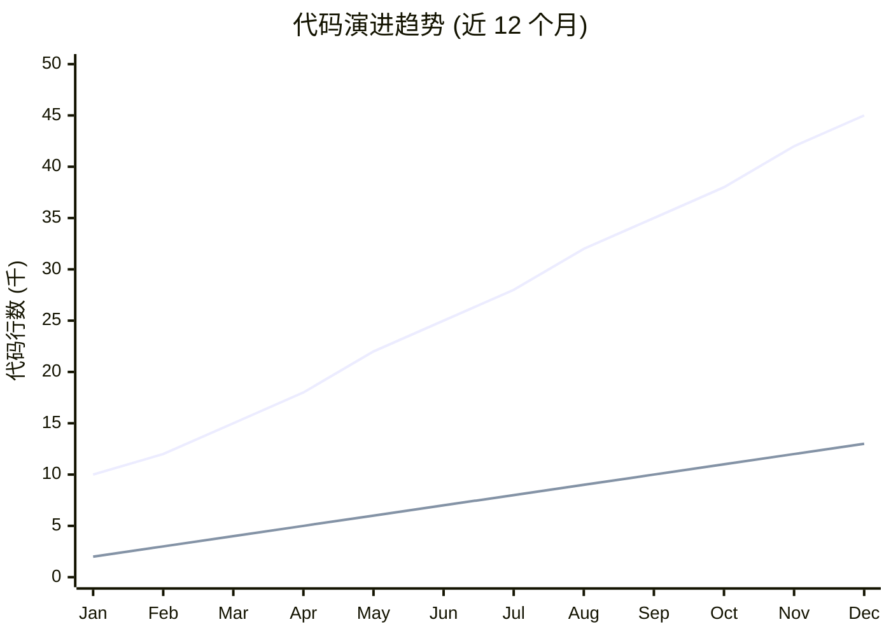
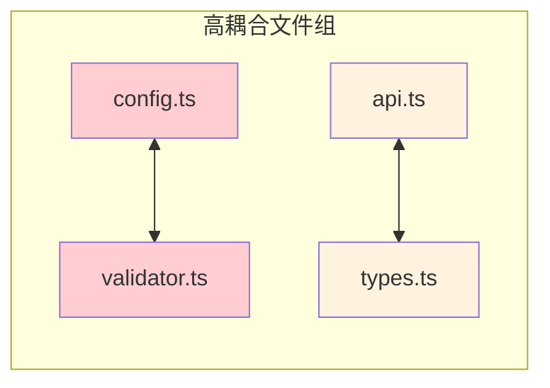
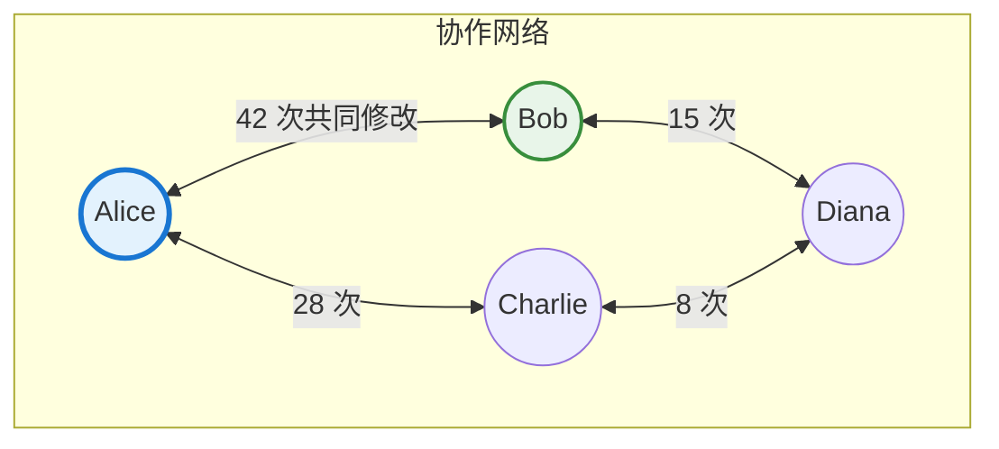
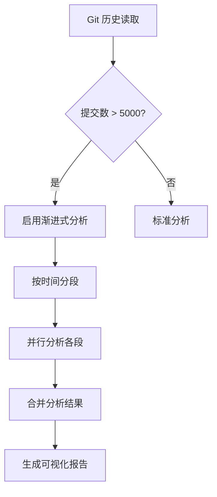

# Repo Analytics / 仓库分析器

> **核心价值**：将 Git 历史数据转化为**可操作的洞察**，帮助团队理解项目演进、识别风险区域、优化协作效率。

深度挖掘 Git 仓库历史数据，生成**多维度、可视化、可操作**的专业统计报告。

## 核心分析维度 / Analysis Dimensions



## 功能特性 / Features

### 1. 贡献者深度画像 (Contributor Profiling)

不仅统计数量，更分析**贡献质量和模式**：

| 分析维度 | 指标 | 洞察价值 |
|---------|------|----------|
| 贡献量 | 提交数、代码行数、文件数 | 基础工作量评估 |
| 贡献质量 | 平均提交大小、代码存活率 | 代码质量指示 |
| 活跃模式 | 活跃时段、周期规律 | 工作习惯分析 |
| 专注领域 | 主要贡献目录/模块 | 知识分布图 |
| 协作网络 | 代码 review、共同修改 | 团队协作分析 |

**贡献者画像卡片**：
```markdown
### 👤 Alice (@alice)

**角色标签**: 🏆 核心贡献者 | 🧠 架构专家 | 🔧 基础设施

| 指标 | 数值 | 排名 |
|------|------|------|
| 总提交 | 156 | #1 |
| 代码行数 | +15,230 / -4,120 | #1 |
| 代码存活率 | 78% | #2 |
| 活跃天数 | 89 | #1 |

**专注领域**:
- `src/core/` (45% 贡献)
- `src/plugins/` (30% 贡献)

**活跃时段**: 工作日 09:00-18:00 (GMT+8)
```

### 2. 代码演进分析 (Code Evolution)

**多维度趋势追踪**：

- **代码增长曲线**：项目规模随时间的变化
- **提交频率图**：开发活跃度的时间分布
- **版本里程碑**：标签/发布版本的时间线
- **分支生命周期**：功能分支的创建、合并、存活时间



### 3. 热点文件分析 (File Churn Analysis)

**识别风险和技术债务**：

| 热点类型 | 特征 | 风险等级 | 建议 |
|---------|------|----------|------|
| 🔴 超级热点 | >50 次修改/季度 | 高 | 考虑拆分重构 |
| 🟠 频繁修改 | 20-50 次修改/季度 | 中 | 审查代码质量 |
| 🟡 定期维护 | 10-20 次修改/季度 | 低 | 正常关注 |
| 🟢 稳定文件 | <10 次修改/季度 | 无 | 保持现状 |

**文件耦合分析**：发现经常一起修改的文件对



### 4. 协作模式分析 (Collaboration Patterns)

**团队协作可视化**：



### 5. 项目健康度评分 (Health Score)

**综合评估项目状态**：

```
项目健康度: 82/100 🟢

├── 活跃度 (25/30)
│   ├── 最近提交: 2 天前 ✅
│   ├── 月均提交: 45 次 ✅
│   └── 活跃贡献者: 5 人 ✅
│
├── 代码质量 (22/30)
│   ├── 测试覆盖: 78% ✅
│   ├── 代码存活率: 72% ⚠️
│   └── 技术债热点: 3 个 ⚠️
│
├── 协作健康 (20/25)
│   ├── 知识分布: 中等 ⚠️
│   ├── 代码审查率: 85% ✅
│   └── 响应时间: 4 小时 ✅
│
└── 文档完整 (15/15)
    ├── README: 完整 ✅
    ├── API 文档: 完整 ✅
    └── 变更日志: 完整 ✅
```

## Hooks

### after_analyze (深度数据挖掘)

进行全面统计分析：

1. **提交历史解析**：
   - `git log --numstat --all` 获取完整历史
   - 解析提交消息、作者、时间戳、文件变更
   
2. **贡献者分析**：
   - 统计每人的提交数、代码量
   - 分析活跃时段和周期
   - 计算代码存活率（未被删除的代码比例）
   
3. **文件热度分析**：
   - 计算每个文件的修改频率
   - 识别文件耦合关系
   - 标记潜在风险文件
   
4. **趋势计算**：
   - 按周/月聚合代码变更
   - 生成增长曲线数据
   - 标记里程碑事件
   
5. 保存到 `cache/repo-stats.json`

**输出数据结构**：
```yaml
# cache/repo-stats.json
summary:
  total_commits: 1250
  total_contributors: 12
  total_files: 156
  code_lines: 45000
  test_lines: 12000
  first_commit: "2022-01-15"
  last_commit: "2024-01-28"

contributors:
  - name: "Alice"
    email: "alice@example.com"
    commits: 156
    additions: 15230
    deletions: 4120
    survival_rate: 0.78
    active_days: 89
    domains:
      - path: "src/core/"
        percentage: 0.45
    active_hours: [9, 10, 11, 14, 15, 16, 17]
    
file_churn:
  - path: "src/core/Engine.ts"
    modifications: 67
    contributors: 4
    risk_level: "high"
    coupled_files:
      - path: "src/core/types.ts"
        coupling_score: 0.85

trends:
  weekly:
    - week: "2024-W01"
      additions: 1200
      deletions: 300
      commits: 25
```

### after_generate (报告生成)

生成专业级可视化报告：

1. **报告页面生成**：
   - 项目概览仪表板
   - 贡献者排行榜
   - 代码演进时间线
   - 风险热点地图
   
2. **Mermaid 图表**：
   - 贡献者饼图
   - 趋势折线图
   - 协作网络图
   - 文件耦合图
   
3. **健康度评分**：计算并展示综合评分

4. 输出到 `wiki/stats/repository.md`

## 配置 / Configuration

在 `.mini-wiki/config.yaml` 中添加专业配置：

```yaml
plugins:
  repo-analytics:
    # 统计时间范围
    time_range:
      days: 365              # 分析最近 N 天
      # 或指定起止日期
      # start_date: "2023-01-01"
      # end_date: "2024-01-01"
    
    # 分析维度开关
    analysis:
      contributors: true     # 贡献者分析
      evolution: true        # 代码演进
      file_churn: true       # 文件热度
      collaboration: true    # 协作模式
      health_score: true     # 健康度评分
    
    # 贡献者设置
    contributors:
      exclude:               # 排除的账号（如机器人）
        - "dependabot[bot]"
        - "github-actions[bot]"
        - "renovate[bot]"
      merge_aliases:         # 合并同一人的不同账号
        - ["alice@work.com", "alice@personal.com"]
      show_emails: false     # 是否显示邮箱
      top_n: 10              # 排行榜显示人数
    
    # 文件分析设置
    files:
      exclude_paths:         # 排除的路径
        - "dist/"
        - "build/"
        - "node_modules/"
        - "*.lock"
        - "*.min.js"
      churn_threshold:       # 热点阈值
        high: 50             # 高风险：>50 次/季度
        medium: 20           # 中风险：20-50 次
        low: 10              # 低风险：10-20 次
    
    # 可视化设置
    charts:
      theme: default         # default | dark | forest
      contributor_pie: true  # 贡献者分布饼图
      evolution_line: true   # 演进趋势线图
      churn_heatmap: true    # 热点热力图
      collab_network: true   # 协作网络图
    
    # 健康度评分权重
    health_weights:
      activity: 30           # 活跃度权重
      quality: 30            # 代码质量权重
      collaboration: 25      # 协作健康权重
      documentation: 15      # 文档完整权重
```

## 输出示例 / Output Example

### 完整统计报告 (`wiki/stats/repository.md`)

```markdown
# 📊 项目统计报告

> 数据更新时间: 2024-01-28 10:30:00 UTC
> 分析范围: 2023-01-28 ~ 2024-01-28 (365 天)

---

## 🎯 项目概览

| 指标 | 数值 | 趋势 |
|------|------|------|
| 总提交数 | 1,250 | ↑ 15% |
| 贡献者数 | 12 | ↑ 2 |
| 代码行数 | 45,000 | ↑ 8,000 |
| 测试覆盖 | 78% | ↑ 5% |
| 健康评分 | 82/100 | 🟢 |

### 项目健康度

​```
██████████████████████░░░░░░░░ 82/100 🟢 良好
​```

| 维度 | 得分 | 状态 |
|------|------|------|
| 活跃度 | 25/30 | ✅ 优秀 |
| 代码质量 | 22/30 | ⚠️ 良好 |
| 协作健康 | 20/25 | ✅ 优秀 |
| 文档完整 | 15/15 | ✅ 满分 |

---

## 👥 贡献者排行榜

### Top 10 贡献者

| # | 贡献者 | 提交 | 代码量 | 存活率 | 专注领域 |
|---|--------|------|--------|--------|----------|
| 1 | 🥇 Alice | 156 | +15.2k / -4.1k | 78% | core, plugins |
| 2 | 🥈 Bob | 98 | +8.5k / -2.3k | 82% | api, tests |
| 3 | 🥉 Charlie | 87 | +6.2k / -1.8k | 75% | docs, i18n |

### 贡献分布

​```mermaid
pie showData
    title 代码贡献分布
    "Alice" : 35
    "Bob" : 22
    "Charlie" : 18
    "Diana" : 12
    "Others" : 13
​```

### 知识分布风险

⚠️ **知识集中度警告**: `src/core/` 目录 65% 的代码由 Alice 贡献，存在单点风险。

**建议**: 安排知识分享会议，让更多成员熟悉核心模块。

---

## 📈 代码演进趋势

### 年度增长曲线

​```mermaid
xychart-beta
    title "代码规模演进 (2023)"
    x-axis ["Q1", "Q2", "Q3", "Q4"]
    y-axis "代码行数 (千)" 0 --> 50
    line "产品代码" [25, 30, 38, 45]
    line "测试代码" [6, 8, 10, 13]
​```

### 提交活跃度

​```mermaid
xychart-beta
    title "月度提交趋势"
    x-axis ["Jan", "Feb", "Mar", "Apr", "May", "Jun"]
    y-axis "提交数" 0 --> 150
    bar [85, 92, 110, 78, 125, 98]
​```

### 里程碑时间线

​```mermaid
timeline
    title 版本发布历史
    section 2023
        v1.0.0 : 首个正式版本
        v1.5.0 : 插件系统
    section 2024
        v2.0.0 : 架构重构
​```

---

## 🔥 热点文件分析

### 高风险热点 (需要关注)

| 文件 | 修改次数 | 贡献者 | 风险等级 | 建议 |
|------|----------|--------|----------|------|
| `src/core/Engine.ts` | 67 | 4 | 🔴 高 | 考虑拆分 |
| `src/api/handlers.ts` | 52 | 3 | 🔴 高 | 代码审查 |
| `src/plugins/loader.ts` | 38 | 2 | 🟠 中 | 持续关注 |

### 文件耦合图

​```mermaid
flowchart LR
    subgraph HighCoupling["高耦合 (>80%)"]
        A["Engine.ts"] <-->|"92%"| B["types.ts"]
        C["handlers.ts"] <-->|"85%"| D["validators.ts"]
    end
    
    subgraph MediumCoupling["中耦合 (50-80%)"]
        E["config.ts"] <-->|"65%"| F["schema.ts"]
    end
    
    style A fill:#ffcdd2
    style B fill:#ffcdd2
​```

---

## 🤝 协作网络

​```mermaid
flowchart TB
    subgraph CoreTeam["核心团队"]
        Alice((Alice))
        Bob((Bob))
    end
    
    subgraph Contributors["贡献者"]
        Charlie((Charlie))
        Diana((Diana))
    end
    
    Alice <-->|"42"| Bob
    Alice <-->|"28"| Charlie
    Bob <-->|"15"| Diana
    
    style Alice fill:#e3f2fd,stroke:#1976d2,stroke-width:3px
​```

---

## 📋 改进建议

基于数据分析，推荐以下改进措施：

| 优先级 | 建议 | 依据 |
|--------|------|------|
| 🔴 高 | 重构 `Engine.ts` | 修改频率过高，存在技术债务 |
| 🟠 中 | 知识分享 `src/core/` | 知识过于集中 |
| 🟡 低 | 增加测试覆盖 | 测试/代码比例可提升 |

---

*报告由 repo-analytics 插件自动生成*
```

## 🚀 大型项目支持 / Large Project Support

### 渐进式历史分析

当检测到大型仓库（提交数 > 5000 或文件数 > 1000）时，自动启用渐进式分析：



**分段策略**：
```yaml
repo_analytics:
  progressive:
    enabled: auto              # auto / always / never
    segment_by: quarter        # quarter / month / year
    parallel_segments: 4       # 并行分析段数
    cache_intermediate: true   # 缓存中间结果
```

**进度跟踪**（`cache/analytics-progress.json`）：
```json
{
  "total_commits": 8500,
  "analyzed_segments": ["2024-Q1", "2024-Q2"],
  "pending_segments": ["2024-Q3", "2024-Q4"],
  "intermediate_results": "cache/analytics-partial.json"
}
```

### 增量分析

对于已分析过的仓库，只分析新增的提交：
```
🔍 检测到增量更新
上次分析: 2026-01-20 (commit: abc123)
新增提交: 45 个

👉 是否进行增量分析？输入 "增量分析" 或 "完整分析"
```

---

## 🔄 报告升级支持 / Report Upgrade Support

### 报告质量检测

在 `after_analyze` 钩子中检测现有报告质量：

| 质量等级 | 分析维度 | 可视化 | 建议 |
|---------|---------|--------|------|
| `basic` | 2-3 | 无图表 | 无 |
| `standard` | 4 | 基础图表 | 有限 |
| `professional` | 5+ | 交互图表 | 详细 |

### 升级策略

当检测到旧版本报告时：
```
📊 仓库分析报告升级检测

当前报告版本: 1.0.0 (basic)
目标版本: 2.0.0 (professional)

缺少的分析维度:
┌────────────────┬──────────┬─────────────────┐
│ 维度           │ 当前状态 │ 升级后          │
├────────────────┼──────────┼─────────────────┤
│ 贡献者画像     │ 基础统计 │ 深度画像+角色   │
│ 代码演进       │ 无       │ 趋势图+里程碑   │
│ 协作网络       │ 无       │ 网络图+中心度   │
│ 健康度评分     │ 无       │ 多维度评分      │
└────────────────┴──────────┴─────────────────┘

👉 输入 "升级分析报告" 开始升级
```

---

## 手动命令（仅供人工参考）

出于安全模型（指令型插件，不执行代码），此处不包含命令示例。如需 CLI 用法，请参考项目 README。

## 最佳实践 / Best Practices

### ✅ 推荐做法

1. **定期运行分析**：每周/每月生成报告，追踪趋势
2. **关注知识分布**：避免知识过度集中于个人
3. **监控热点文件**：高频修改文件可能需要重构
4. **使用健康评分**：作为项目状态的客观指标

### ❌ 避免做法

1. **忽视警告**：高风险热点不处理会累积技术债务
2. **过度解读**：数据仅供参考，需结合实际情况
3. **惩罚性使用**：不应用于绩效考核，会导致数据造假
